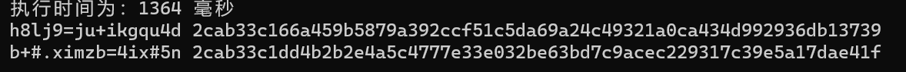
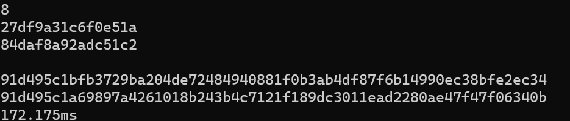
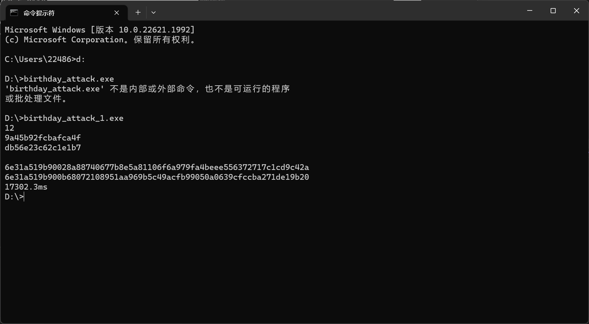

# Project1: implement the naïve birthday attack of reduced SM3

该项目由刘舒畅，王子瑞负责。刘舒畅负责python版本与C++自有库版本，王子瑞负责C++的openssl版本。

## 生日攻击原理

根据概率推算$^{[1]}$（此处略）可得，对于$n$位的消息hash，当随机取$\sqrt{n}$个不相同的消息时，得到一对碰撞的概率约为50%。

## 实现细节

在实现过程中，我们发现，对整体效率影响较大的除哈希算法实现方法外，还有随机字符串的生成方法。随机字符串的生成并非是$O(1)$的，而是$O(len(str))$的，而这个线性因子会被乘进整体的时间复杂度中。此外，如果随机字符串变短，在实际应用中用于寻找碰撞的时间会变长。综合以上考量以及找到碰撞所需最少bit数的要求，我们选定8bytes作为随机字符串的长度。

## 生日攻击实现结果

硬件配置：AMD Ryzen 7 6800H with Radeon Graphics      3.20 GHz

最大碰撞结果为48bit，时间耗费为17s。

### python版本

$OWGBK%Y{M9UFKQD.png)

23s/32bit碰撞

### openssl版本

1.3s/32bit碰撞

### 自有库版本

172ms/32bit

17s/48bit

从相同数量级碰撞对比可以看出，自有库版本的效率要高于openssl版本的效率。

## 参考资料

[1] [哈希碰撞与生日攻击 - 知乎 (zhihu.com)][哈希碰撞与生日攻击]

