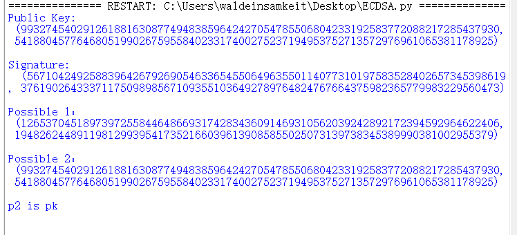

# 		Report-on-the-application-of-this-deduce-technique-in-Ethereum-with-ECDSA

## ECDSA概述

ECDSA 全称 Elliptic Curve Digital Signature Algorith，是基于 ECC 的数字签名算法，在以太坊等区块链网络中大量使用。每一笔区块链交易执行之前都必须进行权限校验，以确保该交易是由账户对应的私钥签发。

ECDSA使用椭圆曲线密码（ECC）对数字签名算法（DSA）模拟。与普通的离散对数问题（DLP）和大数分解问题（IFP）不同，椭圆曲线离散对数问题目前没有亚指数时间的解决方法，因此椭圆曲线密码的单位比特强度要高于其他公钥体制。256 位私钥的 ECDSA 签名可以达到 3072 位 RSA 签名的安全强度。

## 从 ECDSA 签名值逆推公钥

ECDSA 签名机制的一个在区块链场景中非常有用但是 Bitcoin 中没有利用的特性是 可以根据签名值 sig 推算出公钥 PubKey(下文中将使用可恢复签名来代指这一特性).显然，尽量减少每一笔交易/每一个区块的大小, 对于缩减区块体积, 提升区块的传播速度等方面有极大的帮助，这也是Ethereum优于Bitcoin的一点，即Ethereum 中利用了 ECDSA 签名机制的这一特性, 使得Ethereum 交易中没有包含公钥的信息, 验证签名时只需要从签名值中推算公钥即可。

阅读libsecp256k1 库中定义的可恢复密钥结构体，可以看到该结构体的大小为 65 个字节：

```c++
/∗∗ Opaque data structured that holds a parsed ECDSA signature,
 ∗ supporting pubkey recovery.
 ∗
 ∗ The exact representation of data inside is implementation defined and not
 ∗ guaranteed to be portable between different platforms or versions. It is
 ∗ however guaranteed to be 65 bytes in size, and can be safely copied/moved.
 ∗ If you need to convert to a format suitable for storage or transmission, use
 ∗ the secp256k1_ecdsa_signature_serialize_∗ and
 ∗ secp256k1_ecdsa_signature_parse_∗ functions.

 ∗
 ∗ Furthermore, it is guaranteed that identical signatures (including their
 ∗ recoverability) will have identical representation, so they can be
 ∗ memcmp'ed.
 ∗/
 typedef struct {
 unsigned char data[65];
 } secp256k1_ecdsa_recoverable_signature;

```

对比中 libsecp256k1 中的普通 ECDSA 签名值 (根据注释大小保证为 64 个 字节), 可以注意到 secp256k1_ecdsa_recoverable_signature 需要额外的一个字节来存储 额外的信息. libsecp256k1 也提供了相应的签名接口 secp256k1_ecdsa_sign_recoverable.

```c++
/∗∗ Opaque data structured that holds a parsed ECDSA signature.
 ∗
 ∗ The exact representation of data inside is implementation defined and not
 ∗ guaranteed to be portable between different platforms or versions. It is
 ∗ however guaranteed to be 64 bytes in size, and can be safely copied/moved.
 ∗ If you need to convert to a format suitable for storage, transmission, or
 ∗ comparison, use the secp256k1_ecdsa_signature_serialize_∗ and
 ∗ secp256k1_ecdsa_signature_parse_∗ functions.
 ∗/
 typedef struct {
 unsigned char data[64];
 } secp256k1_ecdsa_signature;
```

即ECDSA 签名为了能够从签名值恢复出唯一的公钥值, 还需要存储额外的信息。

下面分析可恢复签名的原理, 以及可恢复签名结构体中额外的一个字节中存储的信息和必要性. 

首先， ECDSA 签名值中的 r ≡ x mod n,(x, y) = kG, x, y ∈ Fp, 根据曲线 secp256k1 的参数可知, n < p < 2n, 则当 x < n 时, r = x, 而当 x >= n, 有 x = r + n. 也即根据 r 以及 x 是否大于 n 这 1 比特的信息可以唯一确定 R = kG 的横坐标 x. 进一 步根据椭圆曲线的方程可以从 x 的值计算出纵坐标 y 的值, 前述已经论述过 y 和 −y 都 是对应 x 的合法值, 也即根据 x 的值以及 y 为奇数还是偶数这 1 比特信息可以唯一确定 点 R = kG. 有了 R 信息之后, 对于合法的签名可以通过如下推算公钥 P:
$$R=s^{-1}(eG+rP)  ->  rP=sR-eG  ->  P=r^{-1}(sR-eG)$$
有了上述理论, 可以通过 libsecp256k1 中函数 secp256k1_ecdsa_sig_sign 的实现来理解额外的一个字节中存储的信息.函数参数 recid 对应可恢复签名结构体 secp256k1_ecdsa_recoverable_signature 中字节数组的最后一个字节. 根据第 22 行可知, 如果 recid 第 2 最低比特为 1, 表示 r > n, 如果最低比特比特为 1, 则 R 的纵坐标是奇数：

```c++
static int secp256k1_ecdsa_sig_sign(const secp256k1_ecmult_gen_context ∗ctx,
secp256k1_scalar ∗sigr, secp256k1_scalar ∗sigs, const secp256k1_scalar ∗
seckey, const secp256k1_scalar ∗message, const secp256k1_scalar ∗nonce, int
∗recid) {
 unsigned char b[32];
 secp256k1_gej rp;
 secp256k1_ge r;
 secp256k1_scalar n;
 int overflow = 0;

 secp256k1_ecmult_gen(ctx, &rp, nonce);
 secp256k1_ge_set_gej(&r, &rp);
 secp256k1_fe_normalize(&r.x);
 secp256k1_fe_normalize(&r.y);
 secp256k1_fe_get_b32(b, &r.x);
 secp256k1_scalar_set_b32(sigr, b, &overflow);
 /∗ These two conditions should be checked before calling ∗/
 VERIFY_CHECK(!secp256k1_scalar_is_zero(sigr));
 VERIFY_CHECK(overflow == 0);

 if (recid) {
 /∗ The overflow condition is cryptographically unreachable as hitting it
requires finding the discrete log
 ∗ of some P where P.x >= order, and only 1 in about 2^127 points meet
this criteria.
 ∗/
 ∗recid = (overflow ? 2 : 0) | (secp256k1_fe_is_odd(&r.y) ? 1 : 0);
 }
 secp256k1_scalar_mul(&n, sigr, seckey);
 secp256k1_scalar_add(&n, &n, message);
 secp256k1_scalar_inverse(sigs, nonce);
 secp256k1_scalar_mul(sigs, sigs, &n);
 secp256k1_scalar_clear(&n);
 secp256k1_gej_clear(&rp);
 secp256k1_ge_clear(&r);
 if (secp256k1_scalar_is_zero(sigs)) {
 return 0;
 }
 if (secp256k1_scalar_is_high(sigs)) {
 secp256k1_scalar_negate(sigs, sigs);
 if (recid) {
 ∗recid ^= 1;
 }
 }
 return 1;
 }
```

## 推导出可能的公钥的python实现

利用Part2推到出的公式，尝试用python实现“从 ECDSA 签名值逆推公钥”：

```python
import secrets

def boolQR(n, p):
    return pow(n, (p - 1) // 2, p)

def solveQR(n, p):
    assert boolQR(n, p) == 1
    if p % 4 == 3:
        return pow(n, (p + 1) // 4, p)
    q = p - 1
    s = 0
    while q % 2 == 0:
        q = q // 2
        s += 1
    for z in range(2, p):
        if boolQR(z, p) == p - 1:
            c = pow(z, q, p)
            break
    r = pow(n, (q + 1) // 2, p)
    t = pow(n, q, p)
    m = s
    if t % p == 1:
        return r
    else:
        i = 0
        while t % p != 1:
            temp = pow(t, 2 ** (i + 1), p)
            i += 1
            if temp % p == 1:
                b = pow(c, 2 ** (m - i - 1), p)
                r = r * b % p
                c = b * b % p
                t = t * c % p
                m = i
                i = 0
        return r

def mod_invese(B, N):
    if B == N:
        return (B, 1, 0)
    else:
        i = 0
        b = [B]
        n = [N]
        q = []
        r = []
        flag = False

        while not flag:
            q.append(n[i] // b[i])
            r.append(n[i] % b[i])
            n.append(b[i])
            b.append(r[i])
            if r[i] == 0:
                flag = True
            i += 1
        tmp = b[i - 1]
        x = [1]
        y = [0]

        i -= 2;
        num = i

        while i >= 0:
            y.append(x[num - i])
            x.append(y[num - i] - q[i] * x[num - i])
            i -= 1

        return (tmp, x[-1], y[-1])


def xgcd(b, n):
    (g, x, y) = mod_invese(b, n)

    if g == 1:
        return x % n
    else:
        return -1


a = 0
b = 7
p = 115792089237316195423570985008687907853269984665640564039457584007908834671663
n = 115792089237316195423570985008687907852837564279074904382605163141518161494337
x = 55066263022277343669578718895168534326250603453777594175500187360389116729240
y = 32670510020758816978083085130507043184471273380659243275938904335757337482424
G = (x, y)

def add(P, Q):  # P!=Q
    if P == 0 and Q == 0:
        return 0
    elif P == 0:
        return Q
    elif Q == 0:
        return P
    else:
        if P[0] > Q[0]:
            tmp = P
            P = Q
            Q = tmp

        Z = []
        t = (Q[1] - P[1]) * xgcd(Q[0] - P[0], p) % p
        Z.append((t ** 2 - P[0] - Q[0]) % p)
        Z.append((t * (P[0] - Z[0]) - P[1]) % p)
        return (Z[0], Z[1])


def epoint_add1(P):  # P==Q
    Z = []
    tmp = (3 * P[0] ** 2 + a) * xgcd(2 * P[1], p) % p
    Z.append((tmp ** 2 - 2 * P[0]) % p)
    Z.append((tmp * (P[0] - Z[0]) - P[1]) % p)
    return (Z[0], Z[1])


def multi(k, g):
    tmp = g
    z = 0
    k_bin = bin(k)[2:]
    k_len = len(k_bin)

    for i in reversed(range(k_len)):
        if k_bin[i] == '1':
            z = add(z, tmp)
        tmp = epoint_add1(tmp)

    return z


def keygen():
    sk = int(secrets.token_hex(32), 16)
    pk = multi(sk, G)
    return sk, pk


def signature(sk, m):
    e = hash(m)
    k = secrets.randbelow(p)  
    R = multi(k, G) 
    r = R[0] % p
    s = xgcd(k, n) * (e + r * sk) % n

    return (r, s)  # 

def deduce(sign, m):
    r = sign[0]
    s = sign[1]
    x = r % p
    y = solveQR(((x ** 3) + 7), p)
    e = hash(m)

    P1 = (x, y)
    P2 = (x, p - y)
    sk1 = multi(s % n, P1)
    tmp = multi(e % n, G)
    tmp_i = (tmp[0], p - tmp[1])
    tmp_1 = add(sk1, tmp_i)
    pk1 = multi(xgcd(r, n), tmp_1)

    sk2 = multi(s % n, P2)
    tmp_2 = add(sk2, tmp_i)
    pk2 = multi(xgcd(r, n), tmp_2)
    return pk1, pk2


if __name__ == '__main__':
    sk, pk = keygen()
    print("Public Key: \n", pk)
    m = "this is message"
    s = signature(sk, m)
    print("\nSignature:\n ", s)
    pub1, pub2 = deduce(s, m)
    print('\nPossible 1：\n', pub1)
    print('\nPossible 2：\n', pub2)
    if pub1==pk:
      print('\np1 is pk\n')
    if pub2==pk:
     print('\np2 is pk\n')

```

得到结果如下图，成功推测出可能得公钥：

