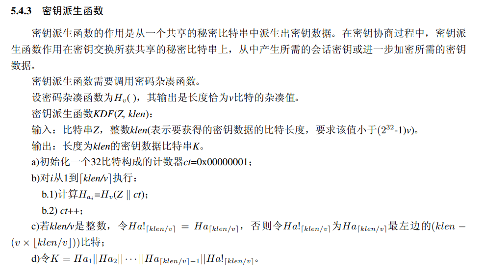
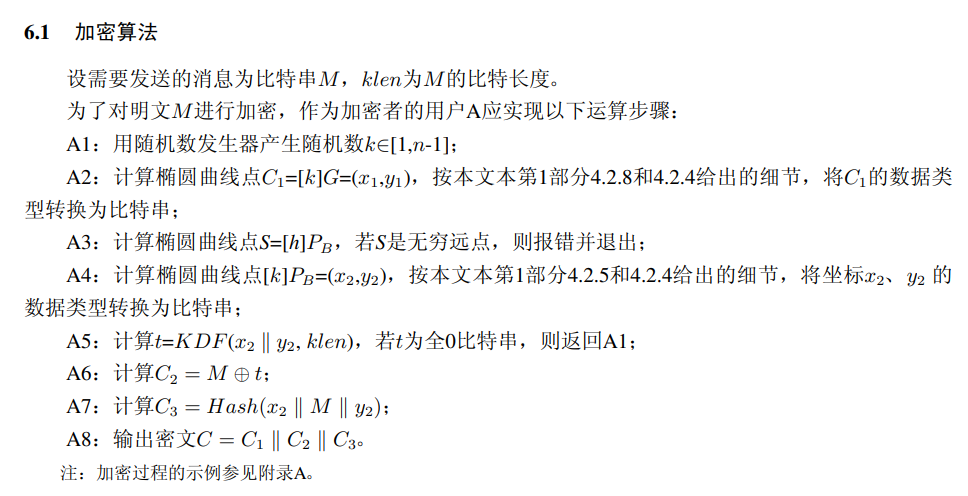
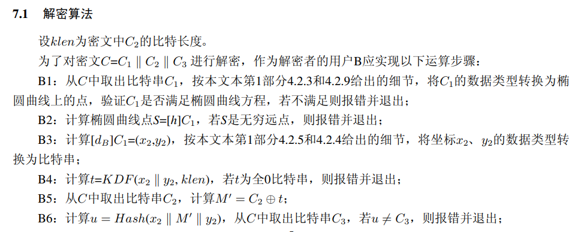
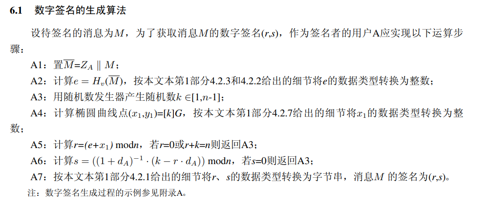
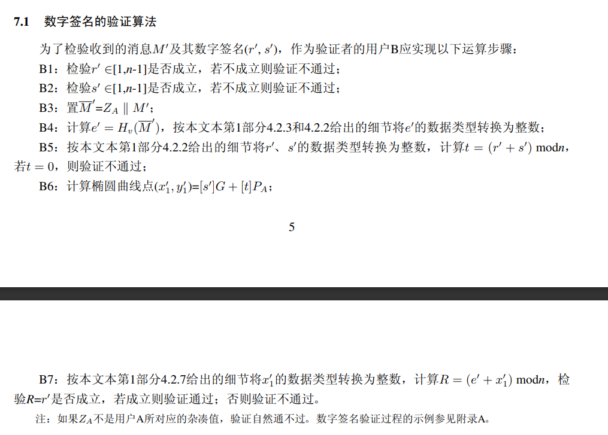
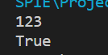

# Project11: impl sm2 with RFC6979

本部分由刘舒畅负责。

## 参数选择

本项目直接使用文档推荐的 $\mathbb{F}_q$上的参数，如下所示：

$p$=`FFFFFFFE FFFFFFFF FFFFFFFF FFFFFFFF FFFFFFFF 00000000 FFFFFFFF FFFFFFFF `

$a$=`FFFFFFFE FFFFFFFF FFFFFFFF FFFFFFFF FFFFFFFF 00000000 FFFFFFFF FFFFFFFC `

$b$=`28E9FA9E 9D9F5E34 4D5A9E4B CF6509A7 F39789F5 15AB8F92 DDBCBD41 4D940E93 `

$n$=`FFFFFFFE FFFFFFFF FFFFFFFF FFFFFFFF 7203DF6B 21C6052B 53BBF409 39D54123 `

$G_x$=`32C4AE2C 1F198119 5F990446 6A39C994 8FE30BBF F2660BE1 715A4589 334C74C7`

$G_y$=`BC3736A2 F4F6779C 59BDCEE3 6B692153 D0A9877C C62A4740 02DF32E5 2139F0A0`

相应代码如下：

```python
        self.p = 0xFFFFFFFEFFFFFFFFFFFFFFFFFFFFFFFFFFFFFFFF00000000FFFFFFFFFFFFFFFF
        self.n = 0xFFFFFFFEFFFFFFFFFFFFFFFFFFFFFFFF7203DF6B21C6052B53BBF40939D54123
        self.a = 0xFFFFFFFEFFFFFFFFFFFFFFFFFFFFFFFFFFFFFFFF00000000FFFFFFFFFFFFFFFC
        self.b = 0x28E9FA9E9D9F5E344D5A9E4BCF6509A7F39789F515AB8F92DDBCBD414D940E93
        self.G = (0x32C4AE2C1F1981195F9904466A39C9948FE30BBFF2660BE1715A4589334C74C7, 0xBC3736A2F4F6779C59BDCEE36B692153D0A9877CC62A474002DF32E52139F0A0)
```

## 椭圆曲线点群计算实现

方便起见，椭圆曲线上的点直接以列表`[x,y]`的形式存储，若为无穷远点$O$，则指定为`None`。

下面是点加与点乘的实现：

```
    def add(self,P,Q):
        assert self.is_on_curve(P) and self.is_on_curve(Q)
        if not P:
            return Q
        if not Q:
            return P
        if P[0] == Q[0]:
            if P[1] != Q[1]:
                return None
            else:
                return self.double(P)
        else:
            lamb = (Q[1] - P[1]) * inverse((Q[0] - P[0]) % self.p, self.p) % self.p

            x3 = (lamb ** 2 - P[0] - Q[0]) % self.p
            y3 = (lamb * (P[0] - x3) - P[1]) %self.p

        return (x3,y3)

    def double(self,P):
        assert self.is_on_curve(P)
        if not P:
            return P
        lmbd = (3 * (P[0] ** 2) + self.a) * inverse((2 * P[1]) % self.p, self.p) % self.p
        x3 = (lmbd ** 2 - 2 * P[0]) % self.p
        y3 = (lmbd * (P[0] - x3) - P[1]) % self.p
        return (x3,y3)
    
    def mul(self,k,P):
        assert self.is_on_curve(P)
        flag = 1<<255
        acc = None
        for _ in range(255):
            if 0 != k & flag:
                acc = self.add(acc, P)
            acc = self.double(acc)
            flag >>= 1
        if 0 != k & flag:
            acc = self.add(acc, P)
        return acc
```

## 加密实现

KDF：



```python
    def kdf(self, z, klen): # z为16进制表示的比特串（str），klen为密钥长度（单位byte）
        klen = int(klen)
        ct = 1
        rcnt = ceil(klen/32)
        zin = [i for i in z]
        ha = ""
        for i in range(rcnt):
            msg = zin + [i for i in binascii.a2b_hex(('%08x' % ct).encode('utf8'))]
            ha = ha + sm3.sm3_hash(msg)
            ct += 1
        return ha[0: klen * 2].encode()
```

Enc：



```python
    def enc(self,m,P):
        M = m.encode()
        k = randint(1, self.n-1)
        G = self.G      
        S = None
        while S == None:
            k = randint(1, self.n-1)        
            S = self.mul(k, P)
        
        x1,y1 = self.mul(k, G)
        x1 = x1.to_bytes(32, "big")
        y1 = y1.to_bytes(32, "big")
        x2,y2 = S
        x2 = x2.to_bytes(32, "big")
        y2 = y2.to_bytes(32, "big")
        t = self.kdf(x2+y2, len(M))
        C1 = x1 + y1
        C2 = bytes(i^j for i,j in zip(M,t))
        C3 = sm3.sm3_hash(func.bytes_to_list(x2 + M + y2))
        return (C1,C2,C3)
```

Dec：



```python
    def dec(self,c):
        C1, C2, C3 = c
        kG = (int.from_bytes(C1[:32],"big"),int.from_bytes(C1[32:],"big"))
        assert self.is_on_curve(kG)
        x2,y2 = self.mul(self.d, kG)
        x2 = x2.to_bytes(32, "big")
        y2 = y2.to_bytes(32, "big")
        t = self.kdf(x2+y2, len(C2))
        M = bytes(i^j for i,j in zip(C2,t))
        u = sm3.sm3_hash(func.bytes_to_list(x2 + M + y2))
        assert u == C3
        return M.decode()
```

## 签名实现

RFC6979对签名过程中随机数的生成给出了一个确定性方案，描述如下：

```
3.2.  Generation of k

   Given the input message m, the following process is applied:

   a.  Process m through the hash function H, yielding:

          h1 = H(m)

       (h1 is a sequence of hlen bits).

   b.  Set:

          V = 0x01 0x01 0x01 ... 0x01

       such that the length of V, in bits, is equal to 8*ceil(hlen/8).
       For instance, on an octet-based system, if H is SHA-256, then V
       is set to a sequence of 32 octets of value 1.  Note that in this
       step and all subsequent steps, we use the same H function as the
       one used in step 'a' to process the input message; this choice
       will be discussed in more detail in Section 3.6.

   c.  Set:

          K = 0x00 0x00 0x00 ... 0x00

       such that the length of K, in bits, is equal to 8*ceil(hlen/8).

   d.  Set:

          K = HMAC_K(V || 0x00 || int2octets(x) || bits2octets(h1))

       where '||' denotes concatenation.  In other words, we compute
       HMAC with key K, over the concatenation of the following, in
       order: the current value of V, a sequence of eight bits of value
       0, the encoding of the (EC)DSA private key x, and the hashed
       message (possibly truncated and extended as specified by the
       bits2octets transform).  The HMAC result is the new value of K.
       Note that the private key x is in the [1, q-1] range, hence a
       proper input for int2octets, yielding rlen bits of output, i.e.,
       an integral number of octets (rlen is a multiple of 8).

   e.  Set:

          V = HMAC_K(V)

   f.  Set:

          K = HMAC_K(V || 0x01 || int2octets(x) || bits2octets(h1))

       Note that the "internal octet" is 0x01 this time.

   g.  Set:

          V = HMAC_K(V)

   h.  Apply the following algorithm until a proper value is found for
       k:

       1.  Set T to the empty sequence.  The length of T (in bits) is
           denoted tlen; thus, at that point, tlen = 0.

       2.  While tlen < qlen, do the following:

              V = HMAC_K(V)

              T = T || V

       3.  Compute:

              k = bits2int(T)

           If that value of k is within the [1,q-1] range, and is
           suitable for DSA or ECDSA (i.e., it results in an r value
           that is not 0; see Section 3.4), then the generation of k is
           finished.  The obtained value of k is used in DSA or ECDSA.
           Otherwise, compute:

              K = HMAC_K(V || 0x00)

              V = HMAC_K(V)

           and loop (try to generate a new T, and so on).

   Please note that when k is generated from T, the result of bits2int
   is compared to q, not reduced modulo q.  If the value is not between
   1 and q-1, the process loops.  Performing a simple modular reduction
   would induce biases that would be detrimental to signature security.
```

代码如下：

```python
    def k_gen(self,m):
        h1 = sm3.sm3_hash(func.bytes_to_list(m)).encode()
        V = b'\x01' * 32
        K = b'\x00' * 32
        K = hmac.new(K, V + b'\x00' + self.d.to_bytes(32,"big") + h1,SM3.SM3).digest()
        V = hmac.new(K, V, SM3.SM3).digest()
        K = hmac.new(K, V + b'\x01' + self.d.to_bytes(32,"big") + h1,SM3.SM3).digest()
        V = hmac.new(K, V, SM3.SM3).digest()
        while(1):
            T = b''
            while len(T) < 32:
                V = hmac.new(K, V, SM3.SM3).digest()
                T = T + V
            k = int.from_bytes(T,"big")
            if 0 < k < self.n:
                return k
            K = hmac.new(K, V + b'\x00',SM3.SM3).digest()
            V = hmac.new(K, V, SM3.SM3).digest()
```

Sign：



```python
    def sign(self, m):
        ZA = sm3.sm3_hash(func.bytes_to_list(b'\x00'+self.a.to_bytes(32,"big")+self.b.to_bytes(32,"big")+self.G[0].to_bytes(32,"big")+self.G[1].to_bytes(32,"big")+self.P[0].to_bytes(32,"big")+self.P[1].to_bytes(32,"big")))
        M = ZA+m
        e = int(sm3.sm3_hash(func.bytes_to_list(M.encode())),16)
        G = self.G
        r = 0
        while r == 0 or r+k == self.n or s == 0:
            k = self.k_gen(M.encode())
            x1,y1 = self.mul(k, G)
            r = (e + x1) % self.n
            s = (inverse(1+self.d, self.n) * (k - r * self.d)) % self.n
        return (r.to_bytes(32,"big"),s.to_bytes(32,"big"))
```

Vrfy：



```python
    def vrfy(self, m, sign, P):
        r,s = sign
        r = int.from_bytes(r,"big")
        s = int.from_bytes(s,"big")
        ZA = sm3.sm3_hash(func.bytes_to_list(b'\x00'+self.a.to_bytes(32,"big")+self.b.to_bytes(32,"big")+self.G[0].to_bytes(32,"big")+self.G[1].to_bytes(32,"big")+P[0].to_bytes(32,"big")+P[1].to_bytes(32,"big")))
        M = ZA+m
        e = int(sm3.sm3_hash(func.bytes_to_list(M.encode())),16)
        t = (r + s) % self.n
        assert t != 0
        x1, y1 = self.add(self.mul(s,self.G),self.mul(t,P))
        R = (e + x1) % self.n
        return R == r
```

## 实现效果



可以看到，成功实现加解密与签名功能。
