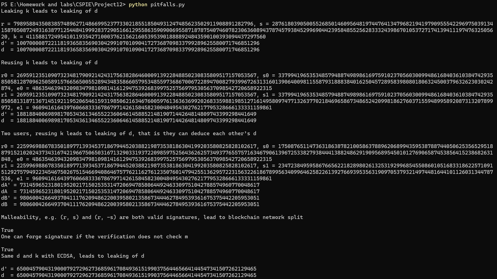
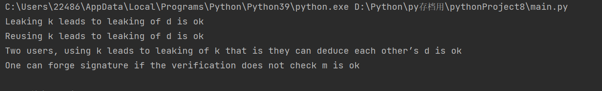
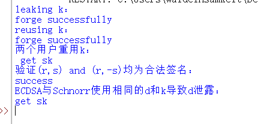

# Project19: forge a signature to pretend that you are Satoshi

本部分由刘舒畅，王子瑞，李昕负责。

## 任务分工

| 姓名   | 任务                                                         |
| ------ | ------------------------------------------------------------ |
| 王子瑞 | sm2的leak k,reuse k,two user reuse k,noncheck message伪造，报告撰写 |
| 刘舒畅 | ECDSA的leak k,reuse k,two user reuse k,noncheck message，(r, s) and (r, -s) 与sm2和ECDSA密钥共用的伪造 |
| 李昕   | Schnorr的leak k,reuse k,two user reuse k,(r, s) and (r, -s) 与Schnorr和ECDSA密钥共用的伪造 |

## ECDSA

ECDSA为DSA签名的椭圆曲线版本，比起DSA效率更高，安全性更强。我们首先编写了关于ECDSA的签名函数，这对于之后的伪造更有利。以下是关键部分代码：

```python

    def sign(self, m):
        e = int(sha256(m.encode()).hexdigest(), 16)
        k = randint(1, self.n - 1)
        G = self.G
        R = self.mul(k, G)
        r = R[0] % self.n
        s = inverse(k, self.n) * (e + self.d * r)
        return (r, s)

    def vrfy_m(self, e, sign, P):
        r, s = sign
        w = inverse(s, self.n)
        G = self.G
        r1, s1 = self.add(self.mul((e * w) % self.n, G), self.mul((r * w) % self.n, P))
        return r == r1
```

#### Keygen

随机取一个在 (1,n−1) 区间上的整数da作为私钥，其中，n为ECDSA的模数。计算Q = da ∗ G ，其中，Q为公钥，G为椭圆曲线循环群的生成元，乘法为椭圆曲线意义下的数乘，表示da个G相加。

#### sign
随机选择一个在（1，n-1）区间上的数k作为临时的会话密钥，并计算P=k*G，这里定义的乘法也为椭圆曲线意义下的数乘，并取P点的横坐标x，计算r=x(mod n).对于消息m，使用sha256计算消息的哈希值H(m)。最后，生成

$s=k^{-1}∗ (H(m)+dA∗r)(mod n)$

返回(r,s)作为签名。

#### verify
计算：sG+H(m)P=(x1,y1), r1≡ x1 mod p。验证r1是否等于r，若是，则通过，若非，则退回。

### leaking k

​	k为随机生成的会话密钥，如果会话密钥泄露，根据ECDSA的生成规则，我们可以直接使用k反推d：

$d=(s*k-e)*r^{-1}$

来进行伪造。

```Python
    def leaking_k():
    print("Leaking k leads to leaking of d\n")
    tmp = ECDSA()
    r,s,k = tmp.sign_k0("123")
    e = int(sha256("123".encode()).hexdigest(),16)
    print("r = {}, s = {}, k = {}".format(r,s,k))
    d = (inverse(r,tmp.n)*(s*k-e))%tmp.n
    print("d' = {}".format(d))
    print("d  = {}".format(tmp.d))
    print()

```

### reusing k
随机生成的会话密钥k不能重复使用，否则可以从两个重复使用的k的签名中导出签名的私钥

设(r0,s0),(r1,s1)为重用k的签名。e0,e1为明文的sha256哈希值。则，我们可以通过计算：

$k_0=(e_0-e_1)*(s_0-s_1)^{-1}(mod n)$,


 $\d=r_0^{-1}*(s_0*k_0-e_0)(mod n)\$

得到私钥d。

```Python
    def reusing_k():
    print("Reusing k leads to leaking of d\n")
    tmp = ECDSA()
    k = randint(1,tmp.n-1)
    r0,s0 = tmp.sign_k1("1",k)
    e0 = int(sha256("1".encode()).hexdigest(),16)
    r1,s1 = tmp.sign_k1("2",k)
    e1 = int(sha256("2".encode()).hexdigest(),16)
    k0 = ((e0-e1)*inverse(s0-s1,tmp.n)) % tmp.n
    d = (inverse(r0,tmp.n)*(s0*k0-e0))%tmp.n
    print("r0 = {}, s0 = {}, e0 = {}".format(r0,s0,e0))
    print("r1 = {}, s1 = {}, e1 = {}".format(r1,s1,e1))
    print("d' = {}".format(d))
    print("d  = {}".format(tmp.d))
    print()
```


### 两个用户重用k

当两个用户使用的会话密钥k是同一个的时候，其中任意一方都可以计算出另一方的私钥d。假设A有签名(r0,s0),消息的哈希值为e0，B有签名(r1,s1)，消息的哈希值为e1。A可以通过:

$d_b=(e_1+d_a*r_1)*s_0*(s_1-e_0)^{-1}*r_0^{-1}$

计算出B的私钥，同理，B也可以通过相同的方式计算出A的私钥。

```Python
   def reusing_k_dif():
    print("Two users, reusing k leads to leaking of d, that is they can deduce each other’s d\n")
    A = ECDSA()
    B = ECDSA()
    k = randint(1,A.n-1)
    r0,s0 = A.sign_k1("1",k)
    e0 = int(sha256("1".encode()).hexdigest(),16)
    r1,s1 = B.sign_k1("2",k)
    e1 = int(sha256("2".encode()).hexdigest(),16)
    dA = ((((e1 + B.d * r1) * s0) * inverse(s1,A.n) - e0)*inverse(r0,A.n)) % A.n
    dB = ((((e0 + A.d * r0) * s1) * inverse(s0,B.n) - e1)*inverse(r1,B.n)) % B.n
    print("r0 = {}, s0 = {}, e0 = {}".format(r0,s0,e0))
    print("r1 = {}, s1 = {}, e1 = {}".format(r1,s1,e1))
    print("dA' = {}".format(dA))
    print("dA  = {}".format(A.d))
    print("dB' = {}".format(dB))
    print("dB  = {}".format(B.d))
    print()
```

### noncheck message


我们定义e作为不被检查的消息。随机选择a,b，计算K=aG+bP，取其横坐标模n作为r，构造

$s=rb^{-1}$,

$e=arb^{-1}$

即可通过验证。

```Python
    def noncheck_m():
    print("One can forge signature if the verification does not check m\n")
    tmp = ECDSA()
    P = tmp.P
    G = tmp.G
    a = randint(1, tmp.n - 1)
    b = randint(1, tmp.n - 1)
    R = tmp.add(tmp.mul(a, G), tmp.mul(b, P))
    r = R[0] % tmp.n
    s = (R[0] * (inverse(b, tmp.n))) % tmp.n
    m = (R[0] * (inverse(b, tmp.n)) * a) % tmp.n
    print(tmp.vrfy_m(m, (r, s), P))
```

### (r,s)与(r,-s)均为合法
ECDSA的特性为，当(r,s)为一个合法签名时，(r,-s)也是其合法签名，可以通过这个进行存在性伪造。

```Python
    def symmetry_s():
    print("Malleability, e.g. (r, s) and (r, -s) are both valid signatures, lead to blockchain network split\n")
    tmp = ECDSA()
    r,s = tmp.sign("123")
    print(tmp.vrfy("123",(r,-s),tmp.P))
```

### ECDSA与sm2共用d与k
在敌手获知了两组签名（其中一组为ECDSA，另一组为sm2，两者使用相同的会话密钥k与私钥d），便可以使用这两组签名以及其对应的明文哈希e恢复密钥:

$d=((s0*s1-e0)*(r0-s0*s1-s0*r1)^{-1})modn_1$

其中（e0,r0,s0,n0）使用ECDSA，而(e1,r1,s1,n1)使用sm2。
```Python
  def two_kind():
    print("Same d and k with ECDSA, leads to leaking of d\n")
    tmp0 = ECDSA()
    tmp1 = sm2()
    tmp1.d = tmp0.d
    tmp1.P = tmp0.P
    r1,s1,k = tmp1.sign("1")
    e1 = int(sm3.sm3_hash(func.bytes_to_list("1".encode())),16)
    r0,s0 = tmp0.sign_k1("0",k)
    e0 = int(sha256("0".encode()).hexdigest(),16)
    d = ((s0*s1-e0)*inverse(r0-s0*s1-s0*r1,tmp1.n)) % tmp1.n
    print("d' = {}".format(d))
    print("d  = {}".format(tmp0.d))
```

## sm2
sm2为国密公钥算法，是基于离散对数与椭圆曲线的以下是关键部分代码：

```python
def n_sign(e,dA):
    r=0
    s=0
    while 1:
        x1,y1=calculate_np(Gx, Gy, k, a, b, p)
        r=(e+x1)%n
        s=(get_inverse(1+dA,n)*(k-r*dA))%n
        if s!=0 and r!=0 and r+k != n :
            break
    return r,s

def n_verify(e,r,s,P):
    t = (r + s) % n
    if t == 0:
        return False
    SG = calculate_np(Gx, Gy, s, a, b, p)
    tG = calculate_np(P[0], P[1], t, a, b, p)
    xx, yy = calculate_p_q(SG[0], SG[1], tG[0], tG[1], a, b, p)
    R = (e + xx) % n
    if R == r:
        return True
```

#### Keygen

随机取一个在 (1,n−1) 区间上的整数da作为私钥，其中，n为sm2的模数。计算Q = da ∗ G ，其中，Q为公钥，G为椭圆曲线循环群的生成元，乘法为椭圆曲线意义下的数乘，表示da个G相加。

#### sign
随机选择一个在（1，n-1）区间上的数k作为临时的会话密钥，并计算P=k*G，这里定义的乘法也为椭圆曲线意义下的数乘，并取P点的横坐标x.对于消息m，使用sm3计算消息的哈希值H(m)，计算$r=x+H(m)(mod n)$。最后，生成:

$s=(1+d)^{-1}∗ (k-r*d)(mod n)$

,返回(r,s)作为签名。

#### verify
计算:

$sG+(s+r)P=(x1,y1), r1≡ x1+e (mod p)$

验证r1是否等于r，若是，则通过，若非，则退回。

### leaking k

​	k为随机生成的会话密钥，如果会话密钥泄露，根据sm2的生成规则，我们可以直接使用k反推d：

$d=(k-s)*(r+s)^{-1}$

来进行伪造。

```Python
def leak_k():
    da,PA=sm2_.get_key()
    r,s=sm2_.sign(msg,IDA,da,PA)
    da_=(sm2_.k-s)*sm2_.get_inverse(r+s,sm2_.n)%sm2_.n
   # print('da:',da_)
    r1,s1=sm2_.sign(msg,IDA,da_,PA)
    if sm2_.verify(msg, r1, s1, IDA, PA):
        print('Leaking k leads to leaking of d is ok')
    else:
        print('fault')

```

### reusing k
随机生成的会话密钥k不能重复使用，否则可以从两个重复使用的k的签名中导出签名的私钥

设(r0,s0),(r1,s1)为重用k的签名。e0,e1为明文的sm3哈希值。则，我们可以通过计算:


$d=(s_1-s_2+r_1-r_2)^{-1}*(s_2-s_1)(mod n)$

得到私钥d。

```Python
def reusing_k():
    m1='I am alice'
    m2='I want to have a grilfriend'
    dA,PA=sm2_.get_key()
    r1, s1 = sm2_.sign(m1, IDA, dA, PA)
    r2, s2 = sm2_.sign(m2, IDA, dA, PA)
    da=(s2-s1)*sm2_.get_inverse(s1-s2+r1-r2,sm2_.n)%sm2_.n
    r,s=sm2_.sign(msg,IDA,da,PA)
    if sm2_.verify(msg,r,s,IDA,PA):
        print('Reusing k leads to leaking of d is ok')
    else:
        print('fault')
```


### 两个用户重用k
当两个用户使用的会话密钥k是同一个的时候，其中任意一方都可以计算出另一方的私钥d。假设A有签名(r0,s0),消息的哈希值为e0，B有签名(r1,s1)，消息的哈希值为e1。A可以通过:

$d_1=(k-s_1)*(r_1+s_1)^{-1}(mod n)$

计算出B的私钥，同理，B也可以通过相同的方式计算出A的私钥。

```Python
   def two_user():
    da_a, pA_a = sm2_.get_key()
    A_r, A_s =sm2_.sign(msg, IDA,da_a,pA_a)
    da_b, pA_b = sm2_.get_key()
    B_r, B_s = sm2_.sign(msg, IDB, da_b, pA_b)
    DA=((sm2_.k-A_s)*sm2_.get_inverse(A_r+A_s,sm2_.n))%sm2_.n
    DB=((sm2_.k-B_s)*sm2_.get_inverse(B_r+B_s,sm2_.n))%sm2_.n
    if DA==da_a and DB==da_b:
        print('Two users, using k leads to leaking of k that is they can deduce each other’s d is ok')
    else:
        print('fault')

```

### noncheck message


具体步骤如下：
我们定义e作为不被检查的消息。随机选择a,b，计算K=aG+bP，取其横坐标模n作为x，构造$r=b-a,s=a$,$e=-x+b-a$，即可通过验证。

```Python
  def noncheck_m():
    da, PA = sm2_.get_key()
    a = randint(1, sm2_.n - 1)
    b = randint(1, sm2_.n - 1)
    r=(b-a)%sm2_.n
    s=a%sm2_.n
    aG=sm2_.calculate_np(sm2_.Gx, sm2_.Gy, a, sm2_.a, sm2_.b, sm2_.p)#aG
    bP=sm2_.calculate_np(PA[0], PA[1], b, sm2_.a, sm2_.b, sm2_.p)  # bP
    xx, yy = sm2_.calculate_p_q(aG[0], aG[1], bP[0], bP[1], sm2_.a, sm2_.b, sm2_.p)
    e=(-xx+b-a)%sm2_.n
    if sm2_.n_verify(e,r,s,PA):
        print('One can forge signature if the verification does not check m is ok')
    else:
        print('fault')
```

## Schnorr

Schnorr与ECDSA各问题基本类似，不再赘述。

## 运行方式

ECDSA:将ECDSA模块，sm2模块与pitfalls.py文件放入同一文件夹下，下载import中全部模块，之后可以进行运行。
sm2:将sm2_模块与main.py文件放入同一文件夹下，下载import中全部模块，之后可以进行运行。

Schnorr：将Schnorr.py和Schnorr_pitfalls.py放入同一文件夹，下载import中全部模块，之后可以进行运行。

## 最终结果

我们对其进行验证，发现可以通过







## 参考资料

1.课程PPT

2.https://zhuanlan.zhihu.com/p/31671646

3.https://zhuanlan.zhihu.com/p/59273695
