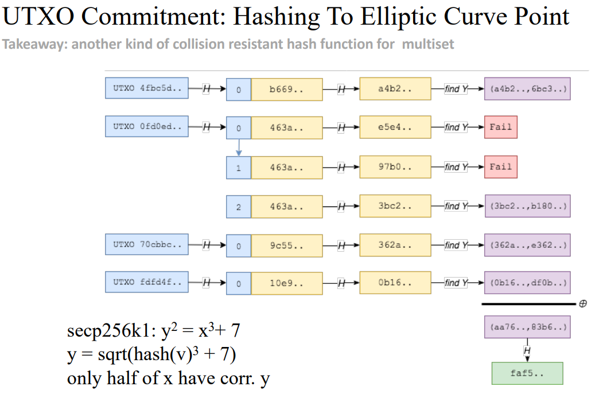
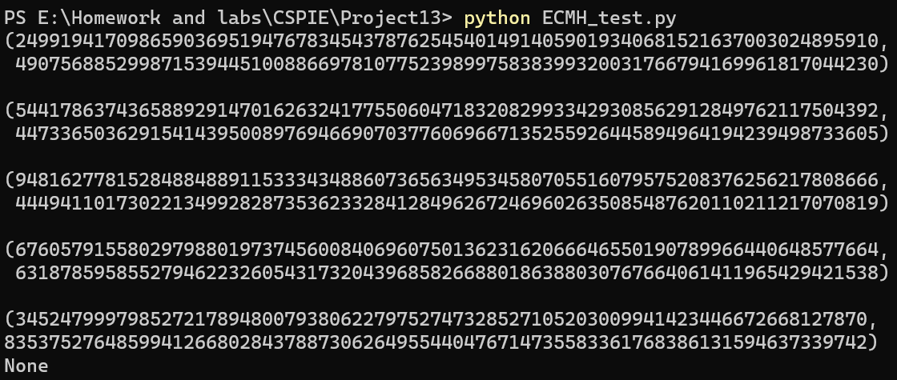

# Project13: Implement the above ECMH scheme

本项目由刘舒畅负责。

## ECMH的用途

在用户进行比特币交易之前，需要先下载一个UTXO集合并验证其状态。

最朴素的方法是，我们将所有的UTXO按某种键值顺序排序，并且按顺序计算出一个哈希值。这样做的问题是，排列造成的时间开销过大。而且，我们并不关心UTXO的顺序，排列造成的时间开销是不必要的。

因此，我们引入哈希求和算法，也即将每个UTXO进行哈希然后求和。但哈希求和算法存在安全性隐患。假设现有UTXO集合为$H_1$，只需找到哈希值为$H_2-H_1$的交易即可伪造哈希值为$H_2$的消息。

回顾整个过程，我们可以提炼出所需摘要算法的特点：

1. 是一个从无序可重集到摘要所在域的单向函数
2. 能够在一定程度上抵抗伪造与碰撞。

而ECHM（Elliptic curve MultiSet Hash）恰好满足上述要求：对于无序可重集中的每个元素，找到一个从元素到椭圆曲线点群的hash，并将所得的点相加。由于点的加法满足交换律和结合律，因此相同的无序可重集即使采用不同的顺序计算，其结果依旧相同。而ECMH的碰撞难度可以归约到对椭圆曲线点群上的离散对数问题，因此也是困难的。

## ECMH的具体实现



根据论文$^{[1]}$（How to Hash into Elliptic Curves）的1.1节，将一个UTXO数据块散列到椭圆曲线点群上较为朴素的方法（‘Try-and-Increment’ Method）即是尝试以哈希值作为x，并计算y的值。如果不成功，则在第一个哈希之前加不同前缀再进行查找。代码如下：

```python
    def TaI(self,m):
        u = sha256(m.encode()).hexdigest()
        for i in range(10):
            x = int(sha256(('0'+hex(i)[2]+u).encode()).hexdigest(),16)
            res = nthroot_mod(x**3+self.a*x+self.b,2,self.p)
            if res != None:
                assert self.is_on_curve((x,res))
                return (x,res)
```

但论文同时也提出，这个方案有一些保密性上的问题：如果想要hash的内容是需要保密的（虽然UTXO不需要保密），则计时攻击可以得到有关消息的一部分信息。其原因在于，只有1/2的点在$\mathbb{F}_P$上有二次根，因此该算法其实是概率级别的。

采用指数计算勒让德符号的方法可以将整个算法降为多项式级别，但复杂度为$O(log^4P)$，比较高。为了解决这个问题，论文第二节给出了一个复杂度为$O(log^3P)$的hash函数$f_{a,b}$，代码如下。

```python
    def fab(self,m):
        u = int(sha256(m.encode()).hexdigest(),16)
        p = self.p
        a = self.a
        b = self.b
        v = ((3*a - pow(u,4,p))*(inverse(6*u,p)))%p
        x = (nthroot_mod((pow(v,2,p)-b-(pow(u,6,p)*inverse(27,p))+p)%p,3,p)+pow(u,2,p)*inverse(3,p))%p
        y = (u*x+v)%p
        if u == 0:
            return None
        assert(self.is_on_curve((x,y)))
        return (x,y)
```

根据论文的证明，该方案可以进行较为安全且计算步数为常数的hash。

## 实现效果

测试数据如下：

```python
tmp = ECMH(0)
tmp.ECMH_add("123")
print(tmp.Sum)
tmp.ECMH_add("123")
print(tmp.Sum)
tmp.ECMH_dev("1234")
print(tmp.Sum)
tmp.ECMH_dev("123")
print(tmp.Sum)
tmp.ECMH_dev("123")
print(tmp.Sum)
tmp.ECMH_dev("1234")
print(tmp.Sum)
```

结果如下图所示：



## 后记

虽然最后基本实现了ECMH的功能，但这个ECMH实际上是有缺陷的——hash函数没有选用从$\{0,1\}^*$到$\mathbb{F}_P$的满域哈希函数，而是简单的取模，这样可能会导致一些碰撞攻击。实际上，满域哈希比较难实现，因此寻找比较费力。

## 参考文献

[1] [226.pdf (iacr.org)](https://eprint.iacr.org/2009/226.pdf)