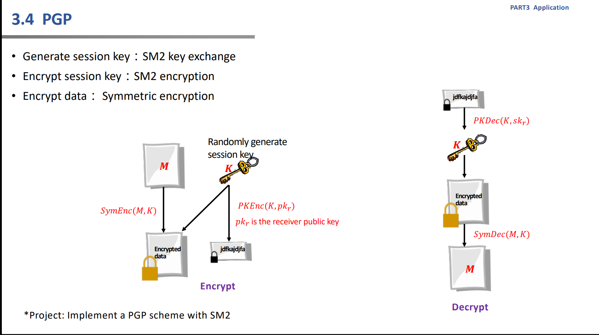
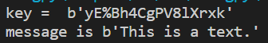

# Project14: Implement a PGP scheme with SM2

本项目由刘舒畅负责。

## 任务分析



该任务实际上是实现一个基于SM2（公钥密码）与对称密码的混合加密，并以此实现一个PGP。

## 实现细节

实际上，现有的PGP除了通过KEM封装对称密码的密钥，还会在明文后级联一个公钥的签名$Sign_{sk_A}(m)$，用于进行对明文来源的验证。因此，我们在我们的PGP类中实现了这一功能。

此外，为了方便观察，我们采用可见字符进行对称密钥的赋值。

具体到使用算法上，我们使用gmssl库中的sm2与sm4实现混合加密，代码如下：

```python
class PGP:
    def __init__(self):
        self.sm2C = CryptSM2("0","0")
        self.d = random.randint(1,0xFFFFFFFEFFFFFFFFFFFFFFFFFFFFFFFF7203DF6B21C6052B53BBF40939D54123)
        self.publickey = self.sm2C._kg(self.d,'32c4ae2c1f1981195f9904466a39c9948fe30bbff2660be1715a4589334c74c7''bc3736a2f4f6779c59bdcee36b692153d0a9877cc62a474002df32e52139f0a0')
        self.privatekey = hex(self.d)[2:]
        self.sm2C = CryptSM2(self.privatekey,self.publickey)
        # print(self.privatekey,self.publickey)
    
    def enc(self,m,pk):
        key = getRandom().encode()
        print("key = ",key)
        sm2_t = CryptSM2(self.privatekey, pk)
        sm4_t = CryptSM4(mode = sm4.SM4_ENCRYPT)
        sm4_t.set_key(key, sm4.SM4_ENCRYPT)
        iv = b'\x00\x00\x00\x00\x00\x00\x00\x00\x00\x00\x00\x00\x00\x00\x00\x00'
        K = hex(random.randint(1,0xFFFFFFFEFFFFFFFFFFFFFFFFFFFFFFFF7203DF6B21C6052B53BBF40939D54123))
        sign = sm2_t.sign(m,K).encode()
        c1 = sm4_t.crypt_cbc(iv, pickle.dumps((m,sign)))
        c2 = sm2_t.encrypt(key)
        return (c1,c2)
    
    def dec(self,c,pk):
        c1, c2 = c
        key = self.sm2C.decrypt(c2)
        sm2_t = CryptSM2(self.privatekey, pk)
        sm4_t = CryptSM4(mode = sm4.SM4_DECRYPT)
        sm4_t.set_key(key, sm4.SM4_DECRYPT)
        iv = b'\x00\x00\x00\x00\x00\x00\x00\x00\x00\x00\x00\x00\x00\x00\x00\x00'
        m,sign = pickle.loads(sm4_t.crypt_cbc(iv,c1))
        assert sm2_t.verify(sign.decode(),m)
        return m
```

## 实现效果



可成功解密并验证。