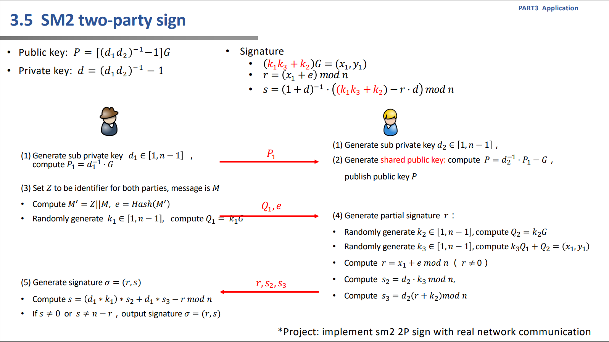
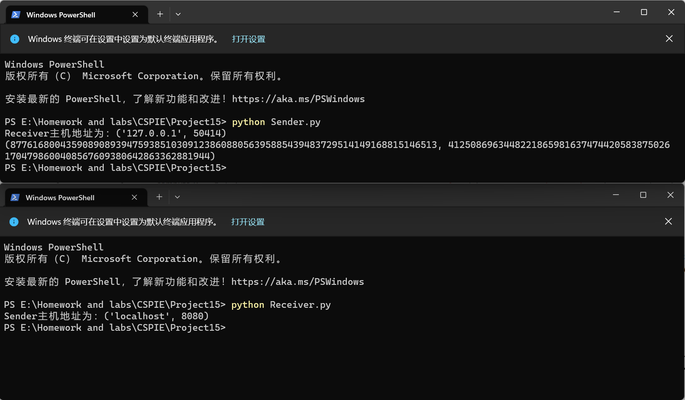

# Project15: implement sm2 2P sign with real network communication

本项目由刘舒畅负责。

## 任务分析



该项目任务为实现基于sm2的双方共同签名。

## 实现细节

sm2继续使用gmssl的sm2库，同时，由于算法中存在椭圆曲线点群上的运算，此处直接使用gmssl提供的函数接口，具体用法如下：

```python
sm2_t._kg(k,g)#k*G
sm2_t._add_point(P,G)#P+G
```

此外，在流程结束后，发起者会对生成的签名进行验证，以确保签名有效。

## 实现效果



通信双方交换了所需信息，发起人成功生成双方签名并成功验证。