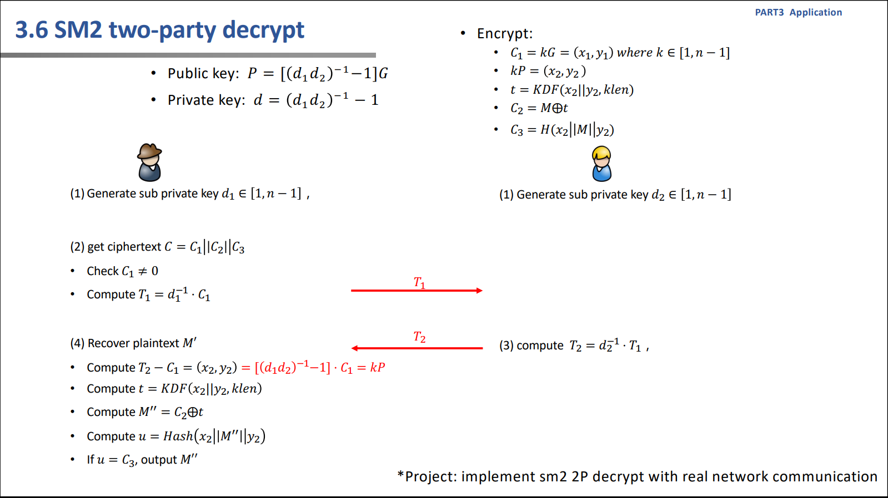
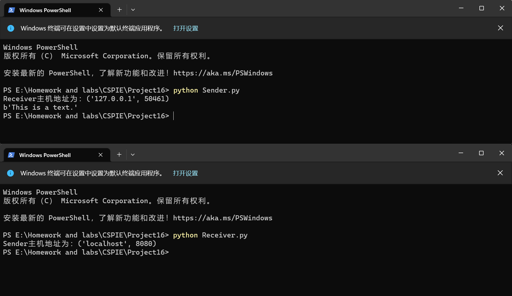

# Project16: implement sm2 2P decrypt with real network communication

本项目由刘舒畅负责。

## 任务分析

本项目为实现双方解密协议。

## 实现细节

算法与椭圆曲线点上运算的实现与Project15基本相同。不同的是本项目需要提前计算出双方加密的密文，因此在进行通信时，双方的私钥都是提前设定好的。

## 实现效果

解密发起者可以解密双方加密的密文。