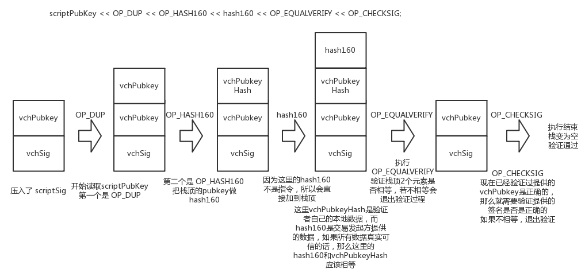

# Project18: send a tx on Bitcoin testnet, and parse the tx data down to every bit, better write script yourself

本部分由刘舒畅负责。

## 获取tx

为了获取tx，笔者采用了一种较为简单的方式，也即先用比特币钱包（Bitcoin wallet）登录testnet，然后向测试网站申请比特币，从而获取tx。具体步骤如下：

1. 获得钱包地址

   

2. 向测试网站申请比特币到钱包地址（testnet:https://coinfaucet.eu/en/btc-testnet/）

   

3. 通过交易地址可以在[交易查询网站](https://live.blockcypher.com/)上查询到详细交易信息和tx。如本次交易笔者的钱包收到了3.46538287个比特币，同时有0.000219个比特币作为矿工费。此外，后续已有六个链接区块，因此该区块有效。

   

   

## 解析tx

从tx的json解析数据中可以看到`hex`一栏，也即

```
02000000017068681de49f874b5f9b0ecf4b65137acedf3e18b1332471a64ace1d12bc78a1000000006a473044022038575d0d58b17398e20ce98e8de0ac4a2bb6a595fe73a817e8775d5a6c58716002204e3295b967ef26bc5495d4001c713b8273f5956454d0167670b7ed14ddf71bfe012103bc7ec78e3d829980100d7309dde86eeae21c7d26ce77799d4e1cb63aa1ddadd0fdffffff02072f971400000000160014089366df20a7597915600aa2ab8e6edbb7f4147c28921000000000001600147dbd2d6e1f0d941d837aa91b0b70f9dab394d2a8ff422500
```

该部分即为tx的原始数据。根据[比特币维基的tx一栏](https://en.bitcoin.it/wiki/Protocol_documentation#tx)，可以对原数据进行解析。

| ield Size | Description  |                          Data type                           |                           Comments                           |
| :-------: | :----------: | :----------------------------------------------------------: | :----------------------------------------------------------: |
|     4     |   version    |                           uint32_t                           |               Transaction data format version                |
|  0 or 2   |     flag     |                     optional uint8_t[2]                      | If present, always 0001, and indicates the presence of witness data |
|    1+     | tx_in count  | [var_int](https://en.bitcoin.it/wiki/Protocol_documentation#Variable_length_integer) |          Number of Transaction inputs (never zero)           |
|    41+    |    tx_in     |                           tx_in[]                            | A list of 1 or more transaction inputs or sources for coins  |
|    1+     | tx_out count | [var_int](https://en.bitcoin.it/wiki/Protocol_documentation#Variable_length_integer) |                Number of Transaction outputs                 |
|    9+     |    tx_out    |                           tx_out[]                           | A list of 1 or more transaction outputs or destinations for coins |
|    0+     | tx_witnesses |                         tx_witness[]                         | A list of witnesses, one for each input; omitted if *flag* is omitted above |
|     4     |  lock_time   |                           uint32_t                           | The block number or timestamp at which this transaction is unlocked:ValueDescription0Not locked< 500000000Block number at which this transaction is unlocked>= 500000000UNIX timestamp at which this transaction is unlockedIf all TxIn inputs have final (0xffffffff) sequence numbers then lock_time is irrelevant. Otherwise, the transaction may not be added to a block until after lock_time (see [NLockTime](https://en.bitcoin.it/wiki/NLockTime)). |

可以看到，原数据的主体部分为tx_in和tx_out，其中比较有趣的部分是两个count的`var_int`数据类型。根据[开发者手册](https://developer.bitcoin.org/reference/transactions.html#compactsize-unsigned-integers)的说明，`var_int`的第一个字节决定了该变量的长度。具体如下图所示：


在解析完主体之后，我们还需要对tx_in与tx_out做进一步解析：

tx_in：

| Field Size |                       Description                       |                          Data type                           |                           Comments                           |
| :--------: | :-----------------------------------------------------: | :----------------------------------------------------------: | :----------------------------------------------------------: |
|     36     |                     previous_output                     |                           outpoint                           | The previous output transaction reference, as an OutPoint structure |
|     1+     |                      script length                      | [var_int](https://en.bitcoin.it/wiki/Protocol_documentation#Variable_length_integer) |              The length of the signature script              |
|     ?      |                    signature script                     |                           uchar[]                            | Computational Script for confirming transaction authorization |
|     4      | [sequence](http://bitcoin.stackexchange.com/q/2025/323) |                           uint32_t                           | Transaction version as defined by the sender. Intended for "replacement" of transactions when information is updated before inclusion into a block. |

tx_in中的output：

| Field Size | Description | Data type |                           Comments                           |
| :--------: | :---------: | :-------: | :----------------------------------------------------------: |
|     32     |    hash     | char[32]  |           The hash of the referenced transaction.            |
|     4      |    index    | uint32_t  | The index of the specific output in the transaction. The first output is 0, etc. |

tx_out：

| Field Size |   Description    |                          Data type                           |                           Comments                           |
| :--------: | :--------------: | :----------------------------------------------------------: | :----------------------------------------------------------: |
|     8      |      value       |                           int64_t                            |                      Transaction Value                       |
|     1+     | pk_script length | [var_int](https://en.bitcoin.it/wiki/Protocol_documentation#Variable_length_integer) |                   Length of the pk_script                    |
|     ?      |    pk_script     |                           uchar[]                            | Usually contains the public key as a Bitcoin script setting up conditions to claim this output. |

其中，tx_in的script部分需要执行才能对pk进行验证，因此需要进一步解析。

## 解析script

script部分采用了智能合约技术。具体而言，该部分由操作符与数据组成。操作符（OPCODE）占一字节，根据不同的操作符，可以进行不同的操作。数据部分类型为`var_int`，具体解析方法上文已经提到过，这里不再赘述。

script解析过程示例如下：



## 解析结果


