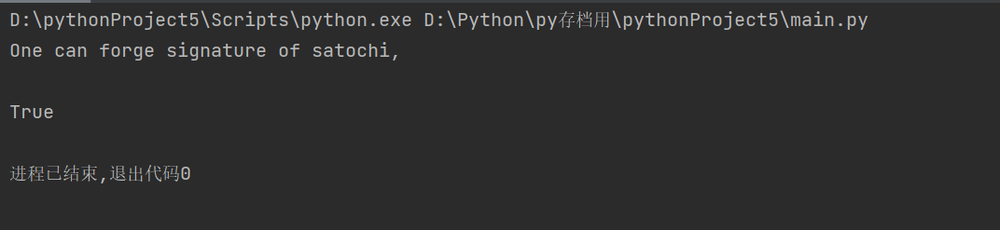

# Project19: forge a signature to pretend that you are Satoshi

本部分由王子瑞负责。

## 任务分工

| 姓名   | 任务                           |
| ------ | ------------------------------ |
| 王子瑞 | 中本聪公钥伪造编写，中本聪公钥寻找尝试，报告撰写 |

## 伪造中本聪公钥

在区块链的身份验证协议下，签名使用ECDSA椭圆曲线签名系统，因此我们要伪造中本聪的身份就需要对ECDSA签名进行伪造攻击。

### ECDSA

​	ECDSA为DSA签名的椭圆曲线版本，比起DSA效率更高，安全性更强。我们首先编写了关于ECDSA的签名函数，这对于之后的伪造更有利。以下是关键部分代码：

```python

    def sign(self, m):
        e = int(sha256(m.encode()).hexdigest(), 16)
        k = randint(1, self.n - 1)
        G = self.G
        R = self.mul(k, G)
        r = R[0] % self.n
        s = inverse(k, self.n) * (e + self.d * r)
        return (r, s)

    def vrfy_m(self, e, sign, P):
        r, s = sign
        w = inverse(s, self.n)
        G = self.G
        r1, s1 = self.add(self.mul((e * w) % self.n, G), self.mul((r * w) % self.n, P))
        return r == r1
```

#### Keygen

随机取一个在 (1,n−1) 区间上的整数da作为私钥，其中，n为ECDSA的模数。计算Q = da ∗ G ，其中，Q为公钥，G为椭圆曲线循环群的生成元，乘法为椭圆曲线意义下的数乘，表示da个G相加。

#### sign
随机选择一个在（1，n-1）区间上的数k作为临时的会话密钥，并计算P=k*G，这里定义的乘法也为椭圆曲线意义下的数乘，并取P点的横坐标x，计算r=x(mod n).对于消息m，使用sha256计算消息的哈希值H(m)。最后，生成$s=k^{-1}∗ (H(m)+dA∗r)(mod n)$,返回(r,s)作为签名。

#### verify
计算：sG+H(m)P=(x1,y1), r1≡ x1 mod p。验证r1是否等于r，若是，则通过，若非，则退回。

### ECDSA伪造

由于ECDSA为可验证安全的公钥加密（签名）算法，因此在机械计算机下我们无法对ECDSA进行合理的伪造。但是在限制条件的情况下（在本例中，我们选择了被验证方不检查消息，也不对消息进行哈希）我们还是可以进行对ECDSA的伪造的。

具体步骤如下：
我们定义e作为不被检查的消息。随机选择a,b，计算K=aG+bP，取其横坐标模n作为r，构造s=$rb^{-1}$,e=$arb^{-1}$，即可通过验证。

```Python
    def noncheck_m():
    print("One can forge signature if the verification does not check m\n")
    tmp = ECDSA()
    P = tmp.P
    G = tmp.G
    a = randint(1, tmp.n - 1)
    b = randint(1, tmp.n - 1)
    R = tmp.add(tmp.mul(a, G), tmp.mul(b, P))
    r = R[0] % tmp.n
    s = (R[0] * (inverse(b, tmp.n))) % tmp.n
    m = (R[0] * (inverse(b, tmp.n)) * a) % tmp.n
    print(tmp.vrfy_m(m, (r, s), P))
```

### 中本聪公钥的寻找
在区块链上计算公钥与区块地址的方法一般是由某个人的公钥使用哈希函数计算出区块的地址信息。而知道区块地址，若改地址有向外转出比特币，我们就可以通过这条转出记录来追踪公钥信息。

基于此，我们在区块链的网站中找到了中本聪的创世节点的信息，但是由于创世节点没有向外转出比特币，因此我们无法采用这种方法来进行公钥寻找。

因此，我们最终采用了假设中本聪公钥的方式来完成本次实验。

## 运行方式
将sm3模块与main.py文件放入同一文件夹下，下载import中全部模块，之后可以进行运行。

## 最终结果
我们对其进行验证，发现可以通过
