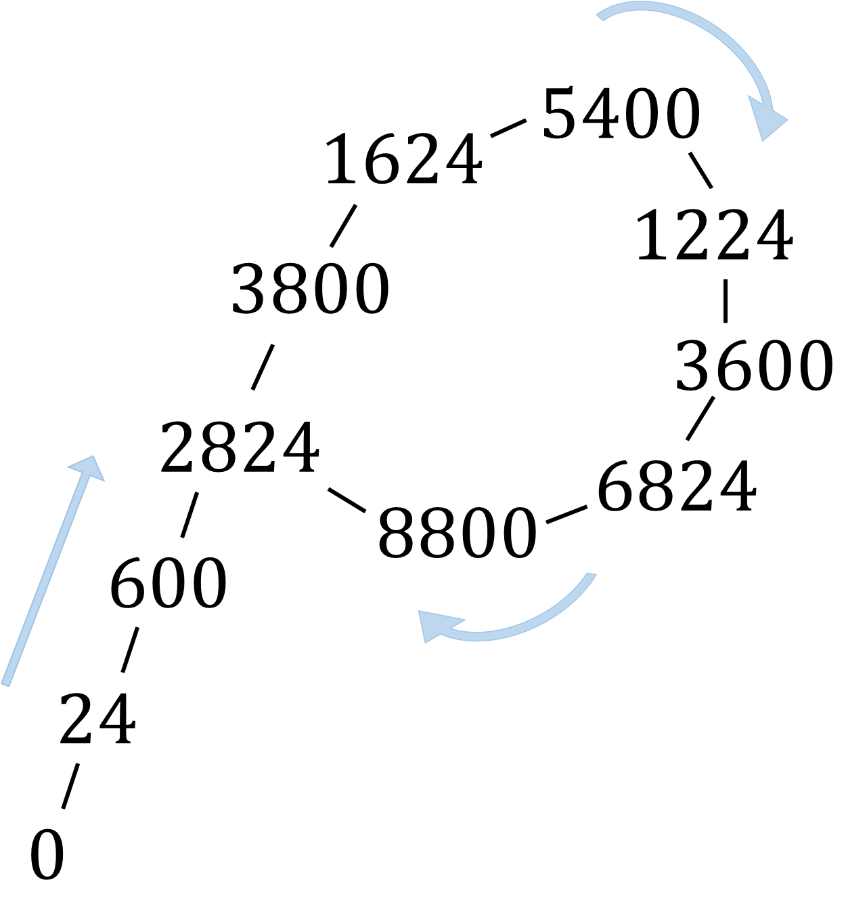
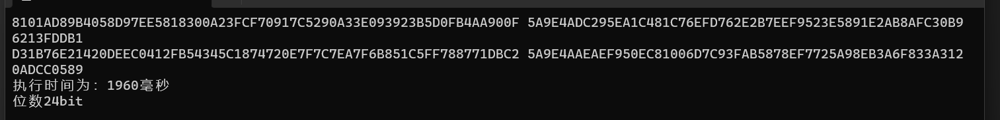
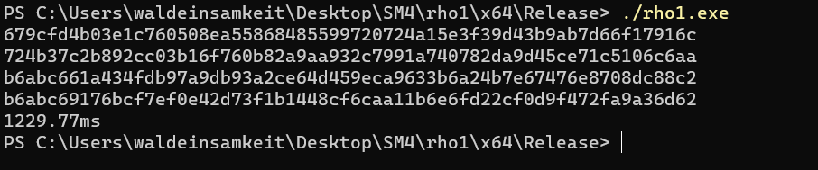

# Project2: implement the Rho method of reduced SM3

该项目由刘舒畅，李昕负责。

共完成三种实现：

| 实现方法           | 负责人 |
| ------------------ | ------ |
| python             | 刘舒畅 |
| 基于OpenSSL的c实现 | 李昕   |
| 基于自建sm3的c实现 | 刘舒畅 |

## 原理思路

Rho-Attack具有生日问题的思想。根据生日问题，序列x(k)mod n最终会重复，一旦一个序列出现重复的值，这个序列就会循环，因为每个值依赖于它之前的值， 这种最终循环的结构产生了“ ρ 算法”的名称。起初随机选择一个数作为初始值，之后迭代循环，在hash值不等时，刷新输入值，具体实现见代码以及注释。

## 实现结果

硬件配置：AMD Ryzen 7 5800H with Radeon Graphics   3.20 GHz

### python版本

| 位数  | 运行时间  |
| ----- | --------- |
| 8bit  | 255 ms    |
| 16bit | 2543 ms   |
| 24bit | 433791 ms |

### 基于openssl C++版本

| 位数  | 运行时间 |
| ----- | :------: |
| 24bit | 1960 ms  |

### 自建sm3 C++版本

| 位数  | 运行时间 |
| ----- | -------- |
| 24bit | 1229 ms  |

