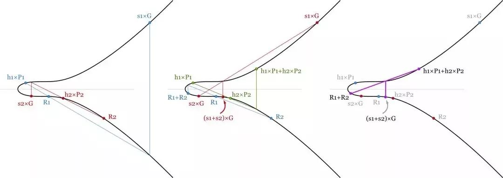

# Project 21： Schnorr batch

本项目由李昕负责

## Schnorr 签名

Schnorr 签名的生成与ECDSA相似，使用了一个点 R 和一个标量s来代替两个标量（r，s）。与 ECDSA 类似的的是，R 是椭圆曲线（R=K×G）上的一个随机点。签名的第二部分计算略有不同: s = k + hash(P,R,m) ⋅ pk。这里的 pk 是私钥，而P = pk×G 则是公钥，m 是消息。然后可通过检查 s×G = R + hash(P,R,m)×P 来验证这个签名。

值得注意的是，这个方程是线性的，所以方程可互相加减，并且仍然有效，这就得来了新的方案。

## Schnorr签名的批量验证

要验证比特币区块链中的区块，我们需确保区块中的所有签名都有效。如果其中一个是无效的，我们不会在乎是哪个无效的，我们只会拒绝掉整个区块。

对于 ECDSA 签名算法，每个签名都必须单独验证。也就是说，如果区块中有 1000 个签名，我们就需要计算 1000 次倒置和 2000 次点乘运算，总共约 3000 次繁重的计算任务。

而通过使用 Schnorr 签名，可以将所有签名验证方程相加，从而节省一些计算能力。对于有 1000 个签名的区块而言，需验证：

(s1+s2+…+s1000)×G=(R1+…+R1000)+(hash(P1,R1,m1)×P1+ hash(P2,R2,m2)×P2+…+hash(P1000,R1000,m1000)×P1000)

由于验证方程是线性的，只要所有签名都有效，几个方程的和就有效，从而提高了计算效率。

