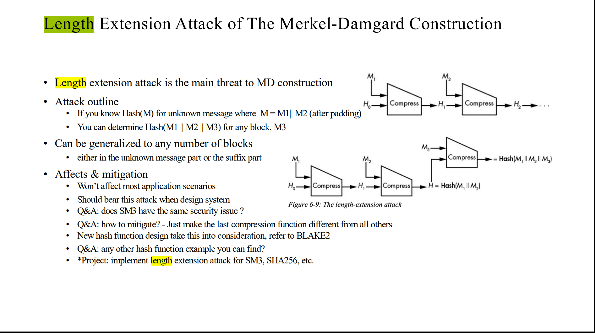
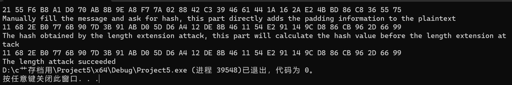
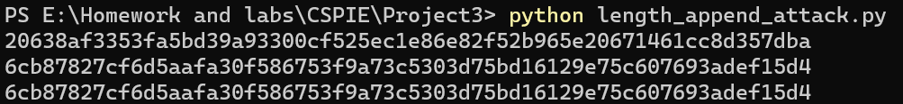
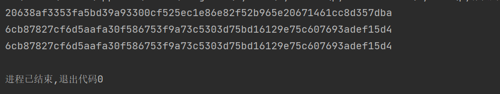

# Project3: implement length extension attack for SM3, SHA256, etc.

本部分由刘舒畅，王子瑞，李昕负责。

## 任务分工

| 姓名   | 任务           |
| ------ | -------------- |
| 刘舒畅 | sm3 python版本编写 |
| 王子瑞 | sm3 C++版本编写    |
| 李昕 | sha256 python版本编写    |

## 项目描述

构造对于hash函数的长度扩展攻击。

## 长度扩展攻击原理

EQM8@F2.png)

以sm3为例，假设我们已知消息 $M_1 $，那么通过消息填充规则，我们可以知道填充后的消息，记作 $P(M_1) $，同时，我们可以得到 $M_1 $的哈希值 $H(M_1) $。由于我们知道迭代压缩函数的细节，因此，我们以将IV设为 $H(M_1) $，并将后半部分消息设置为 $P(P(M_1)||M2)-P(M_1) $，从而获得 $H(P(M_1)||M_2) $。

## 实现效果

可以看到，我们提前计算出的哈希值与直接计算得到的哈希值相同。
