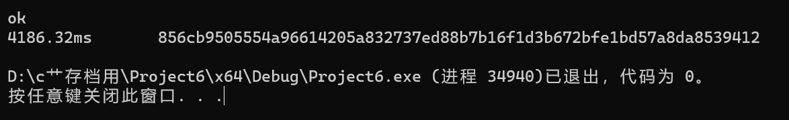
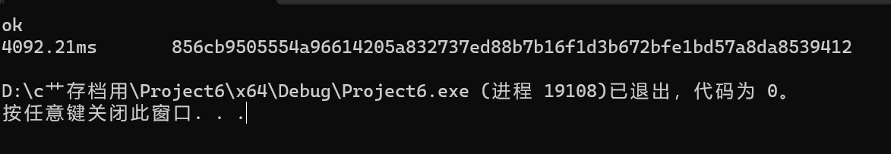
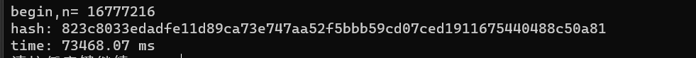

# Project4: do your best to optimize SM3 implementation (software)

本部分由刘舒畅、王子瑞负责。

## 任务分工

| 姓名   | 任务                           |
| ------ | ------------------------------ |
| 刘舒畅 | sm3编写，加速尝试，报告编写    |
| 王子瑞 | openssl、gmssl版本编写 |

## sm3结构 $^{[1]} $

对于用sm3加密的一条消息而言，需要经过填充与迭代压缩两个过程。

### 填充

​	假设消息m 的长度为l 比特。首先将比特“1”添加到消息的末尾，再添加k 个“0”，k是满 足l + 1 + k ≡ 448mod512 的最小的非负整数。然后再添加一个64位比特串，该比特串是长度l的二进 制表示。填充后的消息m′ 的比特长度为512的倍数。

```C++
uint32_t round = (data_len+ 1 + 8 + 64)/64;
    uint8_t* msg = (uint8_t*)malloc(round * 64);
    memset(msg, 0, round*64);
    memcpy(msg, data, data_len);
    msg[data_len] = 0x80;

    for(int i = 0; i < 8; i++){
        msg[round * 64 - i - 1] = ((uint64_t)(data_len<<3)>>(i<<3)) &0xff;
    }
    uint32_t V[8];
    for(int i = 0; i < 8; i++){
        V[i] = IV[i];
    }
```

### 迭代压缩

#### 迭代过程

将填充后的消息m′按512比特进行分组： $m'=B^{(0)}B^{(1)} · · · B^{(n−1)}$ 其中 $n=(l+k+65)/512$。 

对 $m' $按下列方式迭代： 
$$FOR\ i=0\ to\ n-1 :V ^{(i+1)}=CF(V^{(i)},B^{(i)})$$
其中 $CF $是压缩函数， $V ^{(0)} $为256比特初始值 $IV $， $B^{(i)} $为填充后的消息分组，迭代压缩的结果 为 $V^{ (n)} $。

```C++
for(int i = 0; i < round; i++){
        CF(&msg[i*64], V);
    }
```

#### 消息扩展

将消息分组 $B(i) $按以下方法扩展生成132个字 $W_0, W_1, · · · , W_{67}, W'_ 0 , W'_ 1 , · · · , W'_ {63} $，用于压缩函 数 $CF $： 

1. 将消息分组 $B^{(i)} $划分为16个字 $W_0, W_1, · · · , W_{15} $。 
2.  $FOR \ j=16 \ to\  67\ : W_j ← P_1(W_{j−16} ⊕ W_{j−9} ⊕ (W_{j−3} ≪ 15)) ⊕ (W_{j−13} ≪ 7) ⊕ W_{j−6} $
3.  $FOR\  j=0\  to\  63\ : W'_ j = W_j ⊕ W_{j+4} $

```C++
    uint32_t w0[68],w[64];
    for(int i = 0; i < 16; i++){
        w0[i] =  ((uint32_t)B[i * 4 + 0] << 24) & 0xFF000000
                |((uint32_t)B[i * 4 + 1] << 16) & 0x00FF0000
                |((uint32_t)B[i * 4 + 2] << 8 ) & 0x0000FF00
                |((uint32_t)B[i * 4 + 3] << 0 ) & 0x000000FF;
    }
    for(int i = 16; i < 68; i++) w0[i] = P1(((w0[i-16]^w0[i-9])^(rot(w0[i-3],15))))^((rot(w0[i-13],7))^w0[i-6]);
    
    for(int i = 0; i < 64; i++) w[i] = w0[i] ^ w0[i+4];
```

#### 压缩函数

令 $A,B,C,D,E,F,G,H $为字寄存器, $SS1,SS2,TT1,TT2 $为中间变量,压缩函数 $V_{ i+1} = CF(V ^{(i)} , B^{(i)} ), 0 ≤ i ≤ n−1 $。计算过程描述如下： 

 $ABCDEF GH ← V^{ (i)}  $
 $FOR\  j=0 \ to\  63 $ 
 
​	 $SS1 ← ((A ≪ 12) + E + (T_j ≪ j)) ≪ 7  $

​	 $SS2 ← SS1 ⊕ (A ≪ 12)  $

​	 $T T1 ← F F_j (A, B, C) + D + SS2 + W'_j  $

​	 $T T2 ← GG_j (E, F, G) + H + SS1 + W_j $

​	 $ D ← C  $

​	 $C ← B ≪ 9 $

​	 $ B ← A  $

​	 $A ← T T1 $

​	 $ H ← G  $

​	 $G ← F ≪ 19 $

​	 $ F ← E  $

​	 $E ← P_0(T T2)  $

 $ENDFOR  $
 
 $V ^{(i+1)} ← ABCDEF GH ⊕ V ^{(i)} $ 

其中，字的存储为大端(big-endian)格式。

```C++
    uint32_t V0[8];
    for(int i = 0; i < 8; i++) V0[i] = V[i];
    uint32_t ss1 = 0,ss2 = 0,tt1 = 0,tt2 = 0;
    for(int i = 0; i < 64; i++){
        ss1 = rot(rot(V0[0],12)+V0[4]+rot(T[i],(i%32)),7);
        ss2 = ss1^rot(V0[0],12);
        tt1 = V0[3]+ss2+w[i] + (i<16 ? FF0(V0[0],V0[1],V0[2]) : FF1(V0[0],V0[1],V0[2]));
        tt2 = V0[7]+ss1+w0[i]+ (i<16 ? GG0(V0[4],V0[5],V0[6]) : GG1(V0[4],V0[5],V0[6]));
        V0[3] = V0[2];
        V0[2] = rot(V0[1],9);
        V0[1] = V0[0];
        V0[0] = tt1;
        V0[7] = V0[6];
        V0[6] = rot(V0[5],19);
        V0[5] = V0[4];
        V0[4] = P0(tt2);
    }
    for(int i = 0; i < 8; i++) V[i] = V0[i] ^ V[i];
```

## sm3加速

在实践中，我们采用了三种不同的加速方法：函数宏定义化，循环展开，指令集优化。

### 函数宏定义化

sm3的函数大多为位运算，我们可以将这些函数改为宏定义，从而节省进入函数压栈所耗费的时间。例如：

```C++
static uint32_t rot(uint32_t a, uint8_t n)//修改前
{
    return (a << n) | (a >> (32 - n));
}
#define rot(a,n) ((a << n)|(a >> (32 - n)))//修改后
```

### 循环展开

概念上，循环展开是将原来在多次循环中的语句整合到同一次循环中，以获得更好的流水效果。具体而言，我们将压缩函数 $CF $中的循环进行多路展开以探究影响。但是，此处因为sm3的数据依赖较为复杂，单纯的展开并没有起到效果，甚至起到了反效果。因此，我们并没有在最终版本中写入循环展开。

### 指令集优化

在消息扩展时，我们可以依靠SIMD指令集在一个时钟周期内对多个数据进行处理。但由于sm3在计算时需要 $W_{i-3} $一项，这就导致SIMD原有的效果不能完全实现。具体代码如下：

```C++
    register __m128i tmp0,tmp1,tmp2,tmp3,tmp4,tmp5,tmp6,tmp7,tmp8,tmp9,tmp10,tmp11,tmp12;
    for(int i = 16; i < 68; i+=4){
        tmp0 = _mm_loadu_si128((__m128i*)(w0+i-16));
        tmp1 = _mm_loadu_si128((__m128i*)(w0+i-9));
        tmp2 = _mm_xor_si128(tmp0,tmp1);
		tmp3 = _mm_loadu_si128((__m128i*)(w0+i-3));
        tmp4 = rol(tmp3,15);
        tmp5 = _mm_xor_si128(tmp2,tmp4);
        tmp6 = rol(tmp5,15);
        tmp7 = rol(tmp5,23);
        tmp8 = _mm_xor_si128(tmp6,tmp7);
        tmp12 = _mm_xor_si128(tmp8,tmp5);
        tmp9 = _mm_loadu_si128((__m128i*)(w0+i-6));
        tmp10 = _mm_loadu_si128((__m128i*)(w0+i-13));
        tmp11 = rol(tmp10,7);
        *(__m128i*)(w0+i) = _mm_xor_si128(_mm_xor_si128(tmp12,tmp9),tmp11);
        w0[i+3] = P1(w0[i+3-16]^w0[i+3-9]^rot(w0[i+3-3],15))^rot(w0[i+3-13],7)^w0[i+3-6];
    }
    
    for(int i = 16; i < 68; i+=4){
        w0[i+0] = P1(w0[i+0-16]^w0[i+0-9]^rot(w0[i+0-3],15))^rot(w0[i+0-13],7)^w0[i+0-6];
        w0[i+1] = P1(w0[i+1-16]^w0[i+1-9]^rot(w0[i+1-3],15))^rot(w0[i+1-13],7)^w0[i+1-6];
        w0[i+2] = P1(w0[i+2-16]^w0[i+2-9]^rot(w0[i+2-3],15))^rot(w0[i+2-13],7)^w0[i+2-6];
        w0[i+3] = P1(w0[i+3-16]^w0[i+3-9]^rot(w0[i+3-3],15))^rot(w0[i+3-13],7)^w0[i+3-6];
    }
    
    
    for(int i = 0; i < 64/4; i++) *(__m128i*)(w+i*4) = _mm_xor_si128(*(__m128i*)(w0+i*4), *(__m128i*)(w0+i*4+4));
```

但实际上，前半部分由于数据依赖，并不能起到很好的效果，因此最终版本中我们仅保留了后半部分。

## 运行时间

我们以对1<<30字节（1GBytes）数据量的消息进行加密所耗费的时间作为指标，进行对比

sm3（O2）：



sm3_simd（O2）:



openssl（O2）:


gmssl:



可以看出，我们的实现要远快于gmssl的实现（由于时间限制，这里gmssl只进行了4KB数据的摘要），略慢于openssl的实现。

## 参考文献

[1] [SM3密码杂凑算法](https://oscca.gov.cn/sca/xxgk/2010-12/17/1002389/files/302a3ada057c4a73830536d03e683110.pdf)
