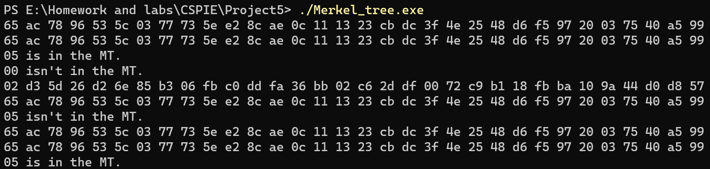

# Project5: Impl Merkle Tree following RFC6962

本项目由刘舒畅负责。

## 项目分析与代码实现

根据RFC6962的原文，Merkle-tree主要由三个组件组成：Merkle-tree散列树，审计路径与一致性证明。

### 散列树

根据`MTH(D[n]) = SHA-256(0x01 || MTH(D[0:k]) || MTH(D[k:n]))`的递推式与100000个节点的固定数量，我们采用了类似线段树的建树方式，代码如下：

```C++
void MT_init(node* now, uint32_t left, uint32_t right){
    // printf("%u, %u\n",left,right);
    now->left = left, now->right = right;
    if(left==right){
        uint8_t tmp[9];
        tmp[0] = 0;
        for(int i = 1; i < 9; i++) tmp[i] = data[8*left+i-1];
        sha256(now->hash, tmp, 9);
        return ;
    }
    now->lson = (node*)malloc(sizeof(node));
    now->rson = (node*)malloc(sizeof(node));
    MT_init(now->lson, left, (left + right) / 2);
    MT_init(now->rson, ((left + right)/2) + 1, right);
    uint8_t tmp[65];
    tmp[0] = 1;
    memcpy((tmp+1), (now->lson->hash), 32);
    // for(int i = 0; i < 32; i++) tmp[i+1] = now->lson->hash[i];
    memcpy((tmp+33), (now->rson->hash), 32);
    sha256(now->hash, tmp, 65);
    return ;
}
```

### 审计路径

假定我们需要证明的点在位置`t`，那么我们就需要`t`的父节点一直到其祖先节点这一路径上的所有值作为证据，代码如下（代码中直接计算出了hash结果）：

```C++
void MT_cal(node* now, uint32_t tar, uint8_t* data_p, uint8_t* hash){
    if(now->left == now->right){
        uint8_t tmp[9];
        tmp[0] = 0;
        for(int i = 1; i < 9; i++) tmp[i] = data_p[i-1];
        sha256(hash, tmp, 9);
        // printf("%d\n",now->left);
        // print(hash);
        // print(now->hash);
        return ;
    }
    uint8_t tmp[65];
    if(tar <= (now->left + now->right)/2){
        MT_cal(now->lson, tar, data_p, hash);
        tmp[0] = 1;
        memcpy(tmp+1, hash, 32);
        memcpy(tmp+33, now->rson->hash, 32);
        sha256(hash, tmp, 65);
    }else{ 
        MT_cal(now->rson, tar, data_p, hash);
        tmp[0] = 1;
        memcpy(tmp+1, now->lson->hash, 32);
        memcpy(tmp+33, hash, 32);
        sha256(hash, tmp, 65);
    }
    return ;
}
```

### 一致性证明

在得到审计路径后，我们就可以验证在`t`位置的值是否为我们向验证的值。过程为从叶节点开始，根据审计路径的值，计算出根节点的hash值，判断根节点hash值是否与记录的相同。由于在使用时，客户端实际上存储审计路径与根节点的hash，所以只对比一次。代码如下：

```C++
bool MT_proof(uint8_t* data_p){
    uint8_t hash[32];
    for(int i = 0; i < 100000; i++){
        if(check_byte(data_p,data+i*8,8)){
            // printf("%d\n",i);
            MT_cal(root, i, data_p, hash);
            print(hash);
            print(root->hash);
            return check_byte(root->hash, hash, 32);
        }
    }
    return 0;
}
```

## 存在性证明与排除性证明

存在性证明，为对某个位置的真实性进行的证明。具体而言，客户端给出想要证明的值，得到相应位置的审计路径后进行递归hash，并将根节点hash与计算出的hash对比。该算法的复杂度为$O(log_2N)$代码如下：

```C++
bool MT_proof_p(uint8_t* data_p, uint32_t pls){
    uint8_t hash[32];
    MT_cal(root, pls, data_p, hash);
    print(hash);
    print(root->hash);
    return check_byte(root->hash, hash, 32);
}
```

但是，排除性证明（不存在证明）相比之下不是很好实现。如果要证明每个位置的hash值都与待证明的hash值不相符，按照存在性证明的方法，就需要所有位置的审计路径，这相当于把整棵树下载下来，使得时间与空间复杂度均为$O(Nlog_2N)$，与申请审计路径的初衷不符。因此，此处仅沿用一致性证明的代码，利用已有数据依次对比以确定不存在。

## 实现效果



从上往下依次为：05是否在MT中（未提供位置），00是否在MT中（未提供位置），05是否在MT中（提供位置为5），05是否在MT中（提供位置为4）。可以看到，得到结果与预期相符。