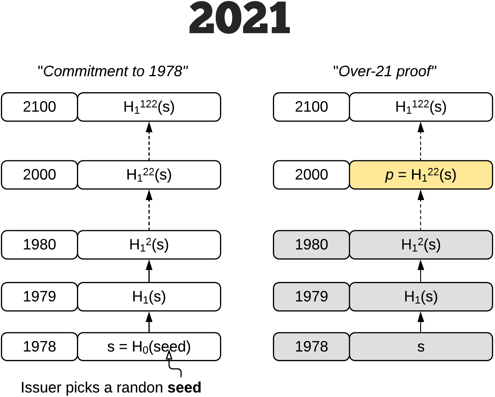
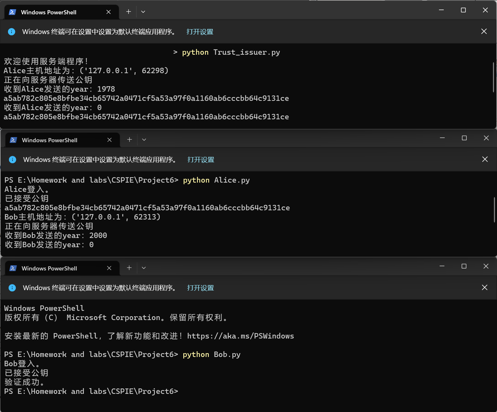

# Project6: impl this protocol with actual network communication

本部分由刘舒畅负责。

## 问题分析



该协议共有三个参与方：A，B以及可信发行方（Trust issuer，Ti）。

假设当前年份为2021，A希望向B说明其年龄大于21岁，但不希望暴漏其真实年龄，因此引入Ti来完成零知识证明过程。

具体过程如下：

1. Ti计算 $s = H_0(seed) $，根据证明的上限（2100年）和A传输给Ti的年龄（1978），计算 $k = 2100-1978 $， $c = H^k_1(s) $，并对 $c $进行签名。之后将 $s $和 $sig_c $传输给A。
2. A收到Ti的消息后，根据B发送的证明要求（ $1978\geq2000 $），计算证据 $d_0 = 2000-1978 $， $p = H_1^{d_0}(s) $，然后将 $p $和 $sig_c $发送给B。
3. B收到A的证明后，计算 $d_1 = 2100-2000 = 100 $， $c' = H_1^d(p) $，并用 $sig_c $与Ti的证书验证 $c' $。

## 实现细节

首先，由于证书分发较难实现，此处仅在开始时由Ti告知A公钥，并由A传递给B。

其次，各参与方通过TCP链接，所传递数据通过`pickle.loads`与`pickle.dumps`打包与解包，样例如下：

```python
sendData = pickle.dumps((self.s,sign))
clientSocket.send(sendData)
self.s,self.sign = pickle.loads(clientSocket.recv(1024))
```

## 实现效果



可以看到，成功实现协议。
