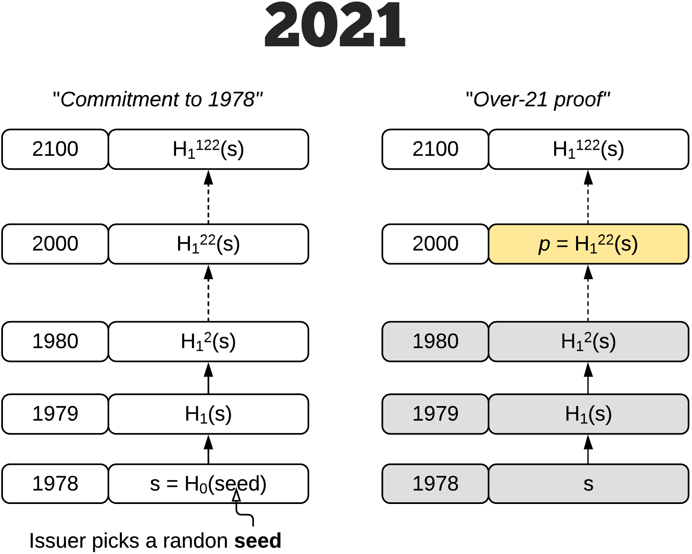
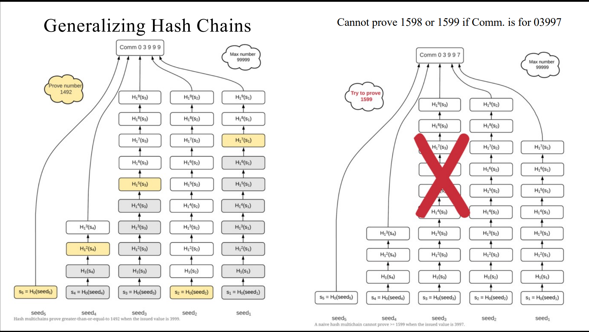
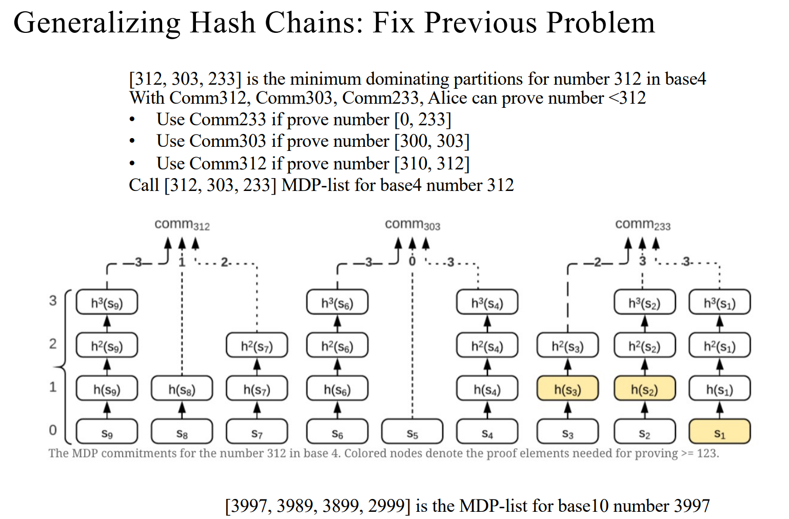
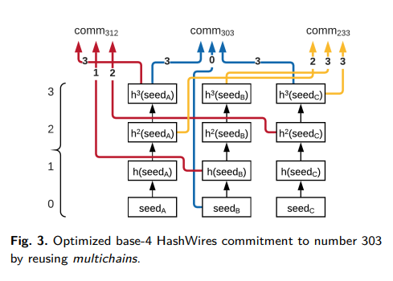
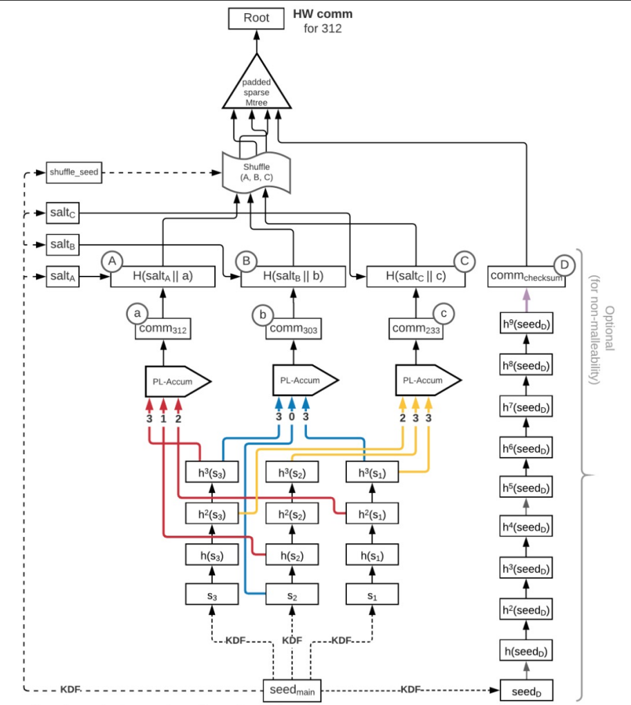
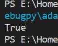

# Project7: Try to Implement this scheme

本部分由刘舒畅，王子瑞负责。

## 组内分工

| 姓名   | 分工                                                         |      |
| ------ | ------------------------------------------------------------ | ---- |
| 刘舒畅 | 分析论文内容，解析各模块用途并编写代码，实现Comm部分，报告编写 |      |
| 王子瑞 | Prove和Verify部分编写                                        |      |

笔者通过论文和课件，尝试通过比较合理的逻辑顺序，讲述从较为朴素的范围证明到HashWire结构的过程。

## 较为朴素的范围证明



实际上，Project7已经提供了一个较为朴素的范围证明，此处不再赘述。这个协议有一个问题：效率很低。需要复杂度为 $O(n) $次hash操作才能完成一次证明验证过程。

## 进制转换方法与MDP（2.4节）

我们可以尝试通过进制转换，把一个具体的k变为一组 $[k_1,k_2,...,k_d],k_i\in\mathbb{F}_b $，其中第i位的commitment为 $H(r_i)^{k_i} $。这样做虽然可以使复杂度降低到 $O(log_bn) $，但是会带来新的问题，如下图所示：



如图所示，该方案的缺陷在于，如果待证明数 $t $有至少一位大于阈值 $k $，那么我们就无法给出有效的证明，但事实上 $k\geq t $。

为此，我们引入最小支配划分（Minimum Dominating Partitions，MDP）的概念。设阈值为 $k $，则对于任意的 $t\leq k $，均存在一个 $q \in MDP $，使得在基为 $b $的情况下， $q_i\geq t_i $，且 $q\leq k $。根据论文给出的算法，我们在代码里对MDP的查找做如下实现：

```python
    def MDP(self,x) -> list:
        d = ceil(log(x+1,self.b))
        res = [x]
        for i in range(1,d):
            bi = self.b**i
            if ((x+1) % (bi)) != 0:
                y = (x//bi)*bi - 1
                res.append(y)
        # print(sorted(list(set(res))))
        return sorted(list(set(res)))
```

有了确定MDP的方法，我们就可以通过MDP构造验证算法。如图所示：



但是，这个方案的时间复杂度和空间复杂度会增加一个 $len(MDP) $的常数。

## 哈希链重用（4.2节）

注意到上文中按MDP生成多组哈希链的方法并不能简单的以一组哈希链重用的方法代替。论文4.2节提到，由于在 $k $唯一的情况下，MDP也是唯一的，而单组哈希链重用会使得恶意的验证者在仅有一组哈希值的情况下，尝试出MDP的所有值，进而还原 $k $，因此是不可行的。

但是，上述问题只存在于验证者可以任意的验证某个commit是否正确的情况下，当我们破坏这一条件就可以避免上述情况。文中给到的方法是在comm生成之后，先加盐hash一遍再生成验证用的证据。这样，验证者即使得到了其他的MDP对应的comm，由于没有对应的salt值，亦无法验证comm是否正确。下面是代码中与加盐hash相关的部分：

```python
            salt = self.KDF(self.seed_m+bytes(x))
            comm.append(sha256(salt+self.PLA(self.p,r,x)).digest())
```

至此，我们已经得到了一个时空复杂度均为 $O(log^2n) $的多重hash算法。



## 更短的单次证据生成：PLA（4.1.1节）

考虑一种情况，假设系统上限 $n $很大，而证明者向系统提出的阈值 $k $很小，令 $d_k = log_bk,\ d_n = log_bn $，那么在生成comm时会计算 $d_n-d_k $个不必要的前导零。为了解决这个问题，论文在4.1.1节引入了填充线性累加器（Padded Linear Accumulator，PLA）的概念，对于阈值 $k $和种子集合 $r $，计算方法如下：

1. 当 $d_k=d_n$ 时， $z_{d_k} = \{z_0 ← H ^{k_1} (r_1), z_i ← (z_{i−1} || H^{ k_{i+1}} (r_{i+1}))\}  $
2. 当 $d_k < d_n$ 时， $z_{d_k}= \{z_0 ← p, z_i ← (z_{i−1} || H^{ k_{i+1}} (r_{i+1}))\}$

代码如下：

```python
    def PLA(self,p,r,k):
        z = b''
        if ceil(log(k,self.b)) < self.d:
            z = p
        for i in range(len(r)):
            z = z+r[i]
        return z
```

在加盐hash之前，只令有效部分进入PLA，即可避免多余计算。

## 更短的 $Comm_{HW} $：SMT（4.1.2节）

在论文原本的证据生成中，MDP生成的各个comm会被简单的级联到一起并hash，以作为最终comm。但是，这样做有两个问题：

1. 验证者在对挑战 $t $验证的时候，事实上只需要MDP上的一条路径，但最终comm的验证需要所有的comm；
2.  $k $应当对验证者保密，但是由于上一条提到的应当其余给出comm， $d_k $事实上被暴漏给了验证者。

为解决上述问题，我们引入稀疏Merkle-tree（SMT）。由于朴素的Merkle-tree会占用 $O(nlogn) $的空间，因此采用了会将不可用叶节点收缩的SMT。此处直接引用现有的SMT库。代码如下：

```python
from smt.tree import *
from smt.proof import *
tree = SparseMerkleTree()
```

## HashWire的Comm部分全貌

在有了上述组件之后，我们可以重现HW的Comm部分。示意图如下：



（shuffle为确定性的Fisher-Yates，论文中并未详细描述实现方法，代码中进行了简单实现，不再赘述。）

代码如下：

```python
    def Comm(self,k):
        sigma = self.MDP(k)

        comm = []
        for x in sigma:
            K = self.divide(x)
            if(len(K)<ceil(log(k,self.b))):
                K = [0]*(ceil(log(k,self.b))-len(K))+K
            r = []
            for i in range(len(K)):
                r.append(self.seed[i-len(K)+self.d][K[i]])
            salt = self.KDF(self.seed_m+bytes(x))
            comm.append(sha256(salt+self.PLA(self.p,r,x)).digest())
            # print(sha256(salt+self.PLA(self.p,r,x)).digest(),x)
        
        while len(comm)<self.d:
            comm.append(None)
        comm = self.shuffle(comm)
        tree = SparseMerkleTree()
        dict = {}
        for i in range(len(comm)):
            if comm[i] != None:
                tree.update(bytes(i),comm[i])
                dict[comm[i]] = bytes(i)
        return (tree,dict)
```

其中`seed[i][j]`为 $H^j(r_i) $。至此，我们已实现Comm部分的功能。

## Prove与Verify部分

在有了对Comm部分的认识后，这两部分也便顺理成章了。

Prove部分为：证明者收到验证者的挑战 $t $，找出MDP中最小的大于 $t $的值，记作 $p $，将前 $d_k-d_t $个种子作为 $r $，计算 $PLA(p,r) $，同时计算出之后 $d_t $个种子的差值哈希 $H^{p_i-t_i}(r_i) $，将这组哈希记为 $h $。之后提取出 $p $对应的 $salt_p $，将 $proof_t = (PLA(p,r),h,salt_p,root_{SMT}) $发送给验证者。代码实现如下：

```python
    def Prove(self,k,t):
        if k < t:
            return None
        T = self.divide(t)
        sigma = self.MDP(k)
        for x in sigma:
            if x >= t:
                MDP = x
                break
        K = self.divide(MDP)
        if(len(K)<ceil(log(k,self.b))):
            K = [0]*(ceil(log(k,self.b))-len(K))+K
        # print(T,K)
        r = []
        for i in range(len(K)-len(T)):
            r.append(self.seed[i-len(K)+self.d][K[i]])
            # print(i-len(K)+self.d,K[i])
        p = self.PLA(self.p,r,MDP)
        res = []
        for i in range(len(K)-len(T),len(K)):
            res.append(self.seed[i-len(K)+self.d][K[i]-T[i-len(K)+len(T)]])
            # print(i-len(K)+self.d,K[i]-T[i-len(K)+len(T)])
        salt = self.KDF(self.seed_m+bytes(MDP))

        return (p,res,salt)
```

Verify部分为：验证者收到 $proof_t $后，以 $PLA(p,r) $为初值，计算 $PLA(t,h) $，然后将该值通过 $salt_p $进行加盐hash，最后将得到的哈希值向SMT验证，查看是否在树上。代码如下：

```python
    def Verify(self,t,proof,dict,root):
        if proof == None:
            return False
        p,r,salt = proof
        T = self.divide(t)
        for i in range(len(T)):
            r[i] = self.Hash(r[i],T[i])
        tmp = sha256(salt+self.PLA(p,r,0.1)).digest()
        # print(tmp)
        pls = dict[tmp]
        proof_t = tree.prove(pls)
        return verify_proof(proof_t, root, pls, tmp)
```

## 实现效果



我们尝试令证明者证明，对于任意的 $t\leq54 $， $t\leq k $。输出结果为`True`，证明验证成功。

## 后记

1. 实际上，这份代码在一些部分，尤其是SMT部分是不完善的（使用的库并没有完全达到要求），键值对的设定需要提前一个字典辅助才能得到证明，这一点显然违反逻辑，希望之后有机会修正。

2. 对于PLA，笔者有些疑问：“由于验证者只接受z(dk-dt)，而dk本身并不会暴漏，因此链的数量是保密的。”但根据上面的计算过程，z(dk-dt)本身的长度会暴漏dk-dt，而验证者持有t，自然持有dt，从而dk实际上是会暴漏给验证者的。由此衍生出两个问题：
   1.论文中是如何实现对 $d_k $的隐匿的？
   2.在PLA每次计算zi时添加hash能否解决“dk暴漏”这个问题？

   但出于尽可能还原论文的考量，这里并没有加入hash，希望日后有机会查证。
