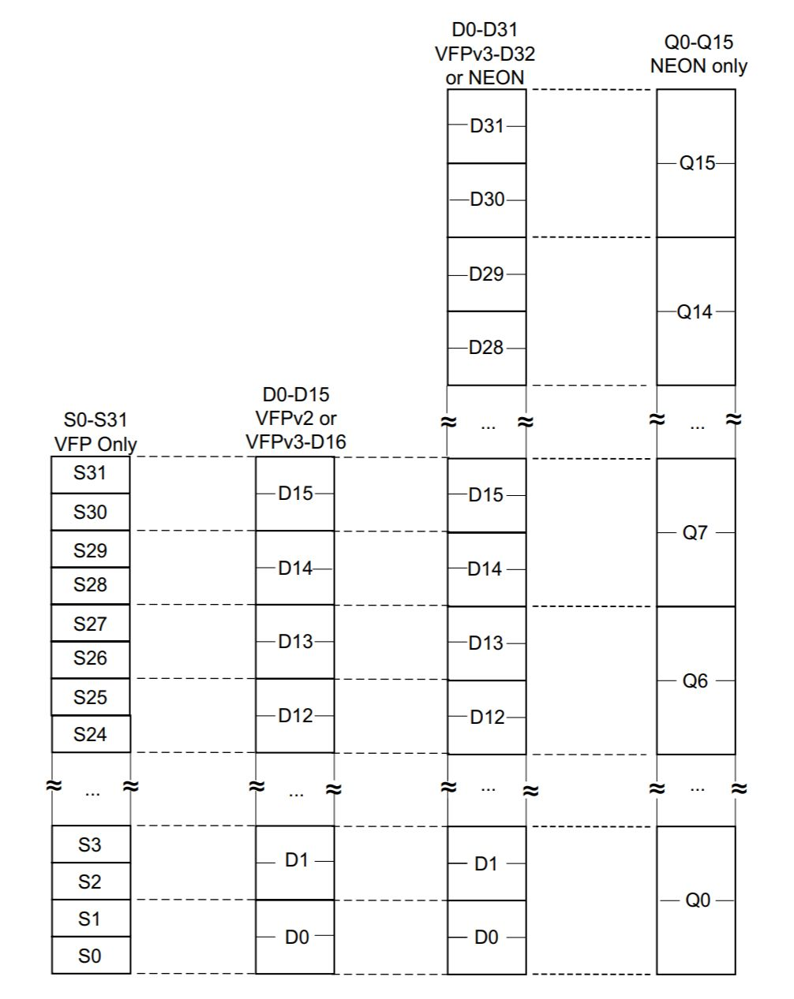
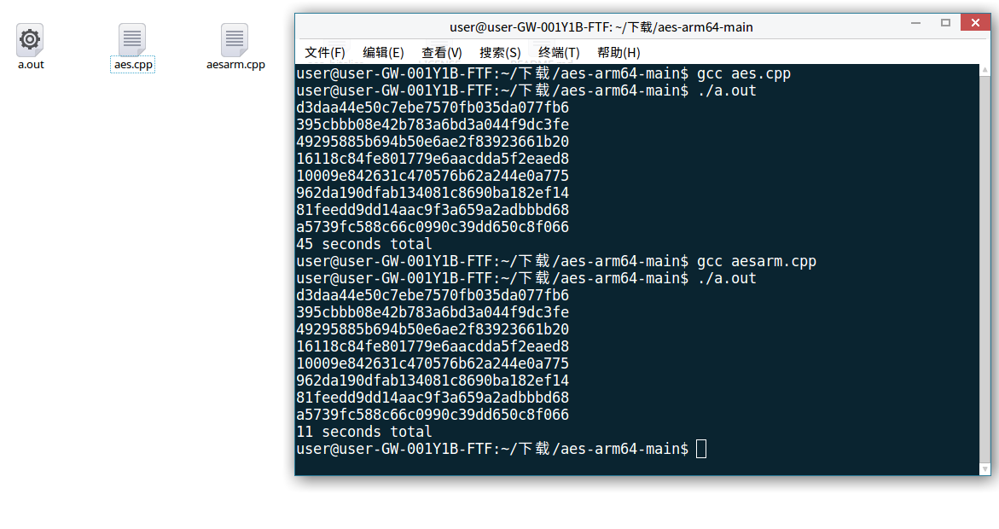

# AES impl with ARM instruction

此project由李昕负责

利用ARM的SIMD指令集NEON实现AES128/192/256三个版本的加速

## SIMD指令概述

SIMD(Single Instruction Multiple Data)即单指令流多数据流，是一种采用一个控制器来控制多个处理器，同时对一组数据（又称“数据向量”）中的每一个分别执行相同的操作从而实现空间上的并行性的技术。简单来说就是一个指令能够同时处理多个数据。

ARM NEON 是适用于 ARM Cortex-A 和 Cortex-R 系列处理器的 SIMD 扩展架构。

## NEON 优化思路

1. 利用NEON指令集的特点，将多个字节一起进行处理。在AES算法中，数据是以128位（16字节）为单位处理的，因此可以利用NEON的128位寄存器来同时处理多个字节。

2. 替换基本的字节操作，例如SubBytes、ShiftRows、MixColumns等，使用NEON指令来实现。NEON提供了一些类似于XOR、AND、OR等的逻辑运算指令，可以用于替代字节操作。这样可以在同一个指令周期内同时处理多个字节，提高加解密速度。
3. 使用NEON指令进行并行加密轮操作。AES算法包含多轮加密，每轮都涉及到SubBytes、ShiftRows、MixColumns和AddRoundKey等步骤。可以使用NEON指令来并行处理多个字节，加速整个加密轮操作。
4. 优化密钥扩展过程。AES算法中的密钥扩展是一个非常重要的步骤，可以利用NEON指令来加速这一过程。NEON提供了一些位移指令和逻辑运算指令，可以用于快速生成扩展密钥。

## 效果比对

选择ARM架构物理机配置如下：

| 配置     | 型号                   |
| -------- | ---------------------- |
| 处理器   | Phytium,FT-2000/4      |
| 内核架构 | aarch64                |
| 操作系统 | Kylin V10（银河麒麟）  |
| 系统配置 | 64bit/4核4线程/2200MHZ |

运行AES128，对128bit数据加密100,000,000轮，得到以下结果：

| 代码    | 运行时间 |
| ------- | -------- |
| AES     | 45s      |
| AES_ARM | 11s      |

