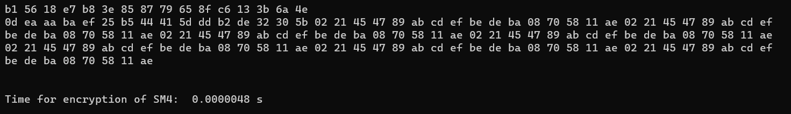
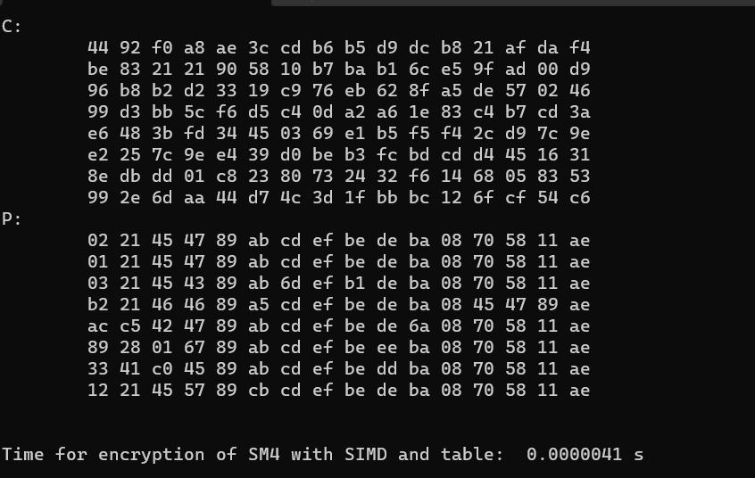
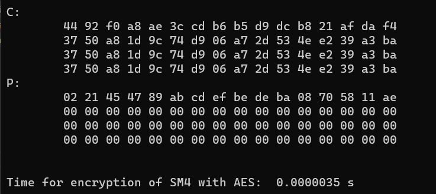

# AES / SM4 software implementation

本project由李昕负责，实现SM4的软件优化加速。

共完成三种实现，分别为利用常见的查找表加速，利用SIMD AVX2指令加速，利用AES-NI指令集加速。

## AES指令集加速设计

基本思想是利用SM4与AES中S盒结构的相似性，借助intel的AES-NI指令完成S盒操作。

因为`AESNI`指令操作的是128bit的数据，SM4一组消息每轮需要查表的数据仅有32bit，故将4组消息打包至一块，使得处理数据内容达到128bit。

在实现时，使用的`_mm_aesenclast_si128`指令，其包括`行移位`、`字节代替（S盒）`以及`轮密钥`加三步。为了消除`行移位`和`轮密钥`加的影响，使用`逆行移位`和`全零轮密钥`来抵消影响

值得注意的是，AESNI只能处理128bit，在理论效率上应低于可以处理256bit的AVX2。

## 实现效果

普通查找表：

SIMD AVX2指令加速：

AESni指令集加速:

